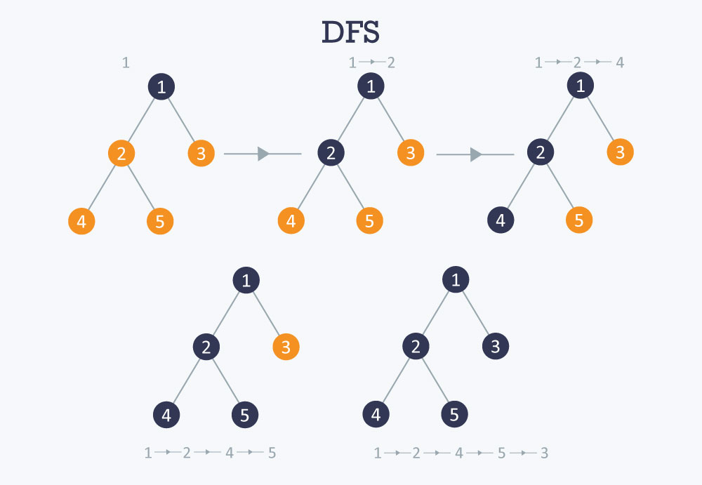

# DFS(Depth-First Search)

### 깊이 우선 탐색이란

\
DFS (Depth-First Search)는 그래프를 탐색하는 알고리즘 중 하나로, 깊이 우선 탐색을 수행합니다. 이 알고리즘은 주로 그래프를 탐색하거나 특정 상태를 찾는 문제에 사용됩니다. 아래는 DFS의 동작 방식에 대한 설명입니다.

<figure><figcaption></figcaption></figure>

1. **스택 또는 재귀 함수 사용**: DFS는 스택(Stack) 자료구조를 사용하거나 재귀 함수를 통해 구현됩니다. 각 정점을 방문할 때마다 해당 정점을 스택에 넣거나, 재귀 호출을 통해 깊이 우선으로 탐색을 진행합니다.
2. **깊이 우선 탐색**: DFS는 가능한 한 깊이 우선으로 탐색을 진행합니다. 즉, 한 정점에서 시작하여 해당 정점과 인접한 정점을 계속 방문하다가 더 이상 방문할 수 없는 정점에 도달하면 되돌아가 이전 정점으로 되돌아가서 탐색을 계속합니다.
3. **방문한 정점 표시**: 각 정점을 방문할 때마다 해당 정점을 이미 방문했다는 표시를 해야 합니다. 이를 통해 같은 정점을 여러 번 방문하는 것을 방지하고 무한 루프를 피할 수 있습니다.
4. **재귀 호출**: DFS를 재귀 함수로 구현할 때는 재귀 호출을 통해 깊이 우선 탐색을 진행합니다. 재귀 호출을 통해 스택의 역할을 수행하며, 재귀 호출을 종료할 조건을 명확히 해야 합니다.
5. **그래프의 종류에 따른 적용**: DFS는 그래프의 구조에 따라 다르게 적용될 수 있습니다. 방향 그래프와 무방향 그래프, 가중치 그래프 등 다양한 그래프에 적용할 수 있으며, 문제에 따라 적합한 방식을 선택해야 합니다.

### How do code?




