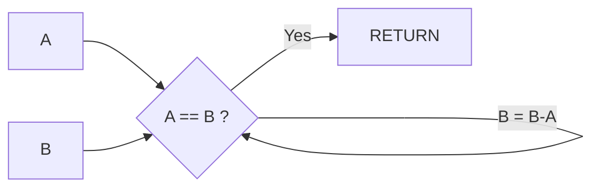

# 유클리드 호제법

두 정수의 최대 공약수를 구하는 알고리즘

### STEP 1

두 수를 비교하여 큰수 에서 작은수를 뺀다.

EX ) 50 : 30 = 50 -30 : 30

### STEP 2

계속 비교하여 남은 두 수가 같아질때 까지 한다.

EX )\
A 20 : 30 = 20 : 30 - 20\
B 20 : 10 = 20 - 10 : 10

### STEP 3

같은 수가 남았으면 최대 공약수 입니다.

***

## How do code?


