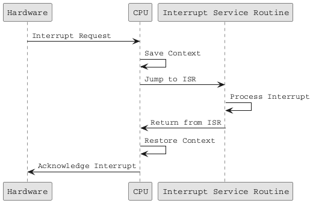

# 운영체제 개요

#### 운영체제 개념 (Operating System Concepts) 1장 요약

***

### 1.1 운영체제가 하는 일 (What Operating Systems Do)

운영체제는 컴퓨터 하드웨어를 관리하고, 응용 프로그램이 실행될 수 있는 환경을 제공하며, 사용자와 하드웨어 간의 중재자 역할을 수행합니다. 이를 통해 시스템 자원을 효율적으로 관리하고, 사용자에게 편리한 인터페이스를 제공합니다.

#### 사용자 관점 (User View)

운영체제는 사용자가 컴퓨터 시스템을 쉽게 사용할 수 있도록 도와줍니다. 이는 사용자가 프로그램을 실행하고, 파일을 관리하며, 네트워크에 접속하는 등의 작업을 수행할 수 있게 합니다.

**직관적인 인터페이스**

스마트폰과 같은 모바일 기기에서는 터치 스크린을 통한 직관적인 인터페이스를 제공합니다. 예를 들어, 스마트폰의 운영체제는 전화 통화, 메시지 전송, 앱 실행 등 다양한 기능을 쉽게 수행할 수 있도록 도와줍니다.

**다양한 사용자 경험**

운영체제는 사용자에게 다양한 경험을 제공하기 위해 설계되었습니다. 이는 그래픽 사용자 인터페이스(GUI)를 통해 사용자가 직관적으로 시스템을 조작할 수 있도록 도와줍니다. 예를 들어, 윈도우 운영체제는 사용자가 아이콘과 윈도우를 사용하여 파일을 관리하고 프로그램을 실행할 수 있게 합니다.

***

#### 시스템 관점 (System View)

시스템 관점에서는 운영체제가 자원의 효율적인 관리와 최적화에 중점을 둡니다. 이는 프로세스 관리, 메모리 관리, 스토리지 관리, 보안 관리 등을 포함합니다.

**프로세스 관리**

운영체제는 여러 프로세스가 동시에 실행될 수 있도록 스케줄링을 관리합니다. 예를 들어, 여러 응용 프로그램이 동시에 실행되는 경우, 운영체제는 각 응용 프로그램에 적절한 CPU 시간을 할당하여 모든 프로그램이 원활하게 실행될 수 있도록 합니다.

**메모리 관리**

운영체제는 메모리를 효율적으로 할당하고 관리합니다. 이는 프로그램이 실행될 때 필요한 메모리를 할당하고, 사용이 끝난 메모리를 해제하는 작업을 포함합니다. 운영체제는 메모리의 효율적인 사용을 위해 다양한 메모리 관리 기법을 사용합니다.

**스토리지 관리**

운영체제는 파일 시스템과 디스크 관리를 포함한 스토리지 관리를 수행합니다. 파일 시스템은 데이터를 저장하고 관리하는 구조이며, 운영체제는 파일 생성, 삭제, 읽기, 쓰기 등의 작업을 지원합니다. 디스크 관리는 데이터를 디스크에 저장하고, 디스크의 효율적인 사용을 보장합니다.

**보안 관리**

운영체제는 데이터를 보호하고 자원에 대한 접근 권한을 제어합니다. 보안은 시스템의 무결성을 유지하고, 악의적인 공격으로부터 데이터를 보호하는 데 중점을 둡니다. 보호는 각 자원에 대한 접근 권한을 설정하고, 권한이 없는 접근을 차단합니다. 이를 통해 시스템의 안정성과 신뢰성을 보장할 수 있습니다.

***

#### 운영체제 정의 (Defining Operating Systems)

운영체제의 범위와 기능은 다양합니다. 일반적으로 운영체제는 하드웨어와 사용자 프로그램 간의 중재자 역할을 수행하는 소프트웨어를 의미합니다.

**커널**

커널은 항상 실행 중인 핵심 프로그램으로, 시스템의 자원을 관리하고 기본적인 운영체제 기능을 제공합니다. 커널은 메모리 관리, 프로세스 관리, 파일 시스템 관리, 장치 드라이버 등의 기능을 포함합니다.

**시스템 프로그램**

시스템 프로그램은 운영체제와 관련된 프로그램입니다. 예를 들어, 파일 관리자, 터미널 에뮬레이터, 시스템 모니터링 도구 등이 있습니다. 이들은 운영체제의 기능을 보조하며, 사용자와 운영체제 간의 인터페이스 역할을 합니다.

**응용 프로그램**

응용 프로그램은 운영체제와 직접 관련 없는 프로그램을 의미합니다. 예를 들어, 워드 프로세서, 웹 브라우저, 게임 등이 있습니다. 운영체제는 이러한 응용 프로그램이 효율적으로 실행될 수 있도록 지원합니다.

***

### 1.2 컴퓨터 시스템 조직 (Computer-System Organization)

컴퓨터 시스템은 CPU, 메모리, I/O 장치 등이 공통 버스를 통해 연결된 구조를 가지고 있습니다. 각 장치 컨트롤러는 특정 장치를 제어하며, 로컬 버퍼 저장소와 특수 목적 레지스터를 유지합니다. 장치 컨트롤러는 장치와 버퍼 저장소 간의 데이터 전송을 담당합니다.

#### 인터럽트 (Interrupts)

인터럽트는 운영체제와 하드웨어 간의 상호작용을 가능하게 하는 중요한 메커니즘입니다. 인터럽트를 통해 CPU는 현재 작업을 중단하고, 중요한 이벤트를 처리할 수 있습니다. 인터럽트는 주로 I/O 작업, 타이머 이벤트, 하드웨어 오류 등을 처리하는 데 사용됩니다.

**인터럽트의 종류**

* **하드웨어 인터럽트**: 외부 하드웨어 장치(예: 키보드, 마우스, 디스크 드라이브 등)에서 발생하는 인터럽트입니다.
* **소프트웨어 인터럽트**: 소프트웨어 명령(예: 시스템 콜, 예외 등)에서 발생하는 인터럽트입니다.

**인터럽트 처리 과정**

1. **인터럽트 발생**: 하드웨어나 소프트웨어가 인터럽트를 발생시킵니다. 예를 들어, 디스크 드라이브가 데이터 전송 완료를 알리기 위해 인터럽트를 발생시킬 수 있습니다.
2. **인터럽트 신호 수신**: CPU는 인터럽트 신호를 수신합니다. 이는 CPU가 현재 실행 중인 작업을 중단해야 함을 의미합니다.
3. **현재 상태 저장**: CPU는 현재 상태(레지스터와 프로그램 카운터 등)를 저장하여 나중에 중단된 작업을 재개할 수 있도록 합니다.
4. **인터럽트 벡터 참조**: CPU는 인터럽트 벡터 테이블을 참조하여, 해당 인터럽트에 대응하는 인터럽트 서비스 루틴(ISR)의 주소를 확인합니다. 인터럽트 벡터 테이블은 각 인터럽트에 대응하는 ISR 주소를 저장한 테이블입니다.
5. **인터럽트 서비스 루틴 실행**: CPU는 ISR로 제어를 전달하고, ISR은 인터럽트를 처리합니다. ISR은 필요한 작업을 수행한 후, 인터럽트 신호를 발생시킨 장치에 신호를 보내 인터럽트 처리가 완료되었음을 알립니다.
6. **상태 복원 및 작업 재개**: ISR 실행이 완료되면, CPU는 저장된 상태를 복원하고 중단된 작업을 재개합니다.



**인터럽트의 중요성**

인터럽트는 시스템의 효율성을 극대화하는 데 중요한 역할을 합니다. 인터럽트를 사용하면 CPU가 I/O 작업을 기다리지 않고, 다른 작업을 수행할 수 있습니다. 예를 들어, 디스크 드라이브에서 데이터 전송이 완료될 때까지 CPU가 대기하지 않고, 다른 유용한 작업을 수행할 수 있습니다. 이로 인해 시스템 자원의 효율적인 사용이 가능해집니다.

인터럽트는 또한 우선순위를 통해 중요한 작업을 즉시 처리할 수 있게 합니다. 높은 우선순위의 인터럽트는 낮은 우선순위의 작업을 중단시키고 즉시 처리됩니다. 이는 시스템의 응답성을 향상시킵니다.

**인터럽트 벡터와 컨트롤러**

인터럽트 벡터는 각 인터럽트에 대한 서비스 루틴의 주소를 저장하는 테이블입니다. CPU는 인터럽트가 발생하면 이 벡터를 참조하여 올바른 ISR로 점프합니다. 인터럽트 컨트롤러는 여러 인터럽트 소스를 관리하고, 이를 CPU로 전달하는 역할을 합니다. 대표적인 인터럽트 컨트롤러로는 PIC(Programmable Interrupt Controller)와 APIC(Advanced Programmable Interrupt Controller)가 있습니다.

```plaintext
+--------------------+
| Interrupt Vector   |
| Table              |
+--------------------+
| Interrupt Request  |
| Lines              |
+--------------------+
| Interrupt          |
| Controller         |
+--------------------+
| CPU                |
+--------------------+
```

**직접 메모리 접근 (DMA)**

DMA(Direct Memory Access)는 CPU의 개입 없이도 메모리와 I/O 장치 간에 직접 데이터를 전송할 수 있는 기술입니다. DMA를 사용하면 CPU는 데이터 전송 중에 다른 작업을 수행할 수 있어, 시스템의 성능이 향상됩니다. DMA 컨트롤러는 데이터 전송을 관리하며, 전송이 완료되면 인터

럽트를 통해 CPU에 완료를 알립니다.

***

#### 저장장치 구조 (Storage Structure)

저장장치는 프로그램과 데이터를 저장하는 데 사용되며, 주 메모리와 보조 저장장치로 구분됩니다.

**주 메모리**

주 메모리는 프로그램을 실행하기 위한 데이터 저장 장소로, DRAM을 사용하여 구현되며 휘발성입니다. 주 메모리는 휘발성이므로 전원이 꺼지면 데이터가 소실됩니다.

**보조 저장장치**

보조 저장장치는 대용량 데이터를 영구적으로 저장하는 역할을 하며, HDD와 SSD가 대표적인 예입니다. 저장장치는 계층적으로 구성되며, 레지스터, 캐시, 메인 메모리, 보조 저장장치, 테이프 등 다양한 종류가 있습니다. 저장장치의 성능은 용량, 접근 속도, 휘발성 여부에 따라 달라집니다.

***

### 1.3 컴퓨터 시스템 구조 (Computer-System Architecture)

#### 단일 프로세서 시스템 (Single-Processor Systems)

단일 프로세서 시스템은 하나의 CPU가 모든 작업을 수행하는 구조입니다. 이 시스템에서는 CPU가 모든 연산 작업을 처리하며, 운영체제는 CPU의 작업을 효율적으로 관리합니다.

#### 다중 프로세서 시스템 (Multiprocessor Systems)

다중 프로세서 시스템은 여러 CPU가 협력하여 작업을 수행하는 구조입니다. 이 시스템에서는 각 CPU가 동시에 작업을 처리할 수 있어, 성능이 향상됩니다. 다중 프로세서 시스템은 대칭형 다중 처리(SMP)와 비대칭형 다중 처리(AMP)로 구분되며, 각 구조에 따라 작업 분배와 자원 관리 방식이 다릅니다.

**대칭형 다중 처리 (SMP)**

SMP에서는 모든 CPU가 동일한 메모리 공간을 공유하고, 동일한 운영체제를 실행합니다. SMP 시스템에서는 각 CPU가 독립적으로 작업을 처리하며, 효율적인 자원 관리를 위해 CPU 간의 작업 분배가 필요합니다.

**비대칭형 다중 처리 (AMP)**

AMP에서는 각 CPU가 특정 작업을 전담하며, 일부 CPU만 운영체제를 실행합니다. 다른 CPU는 지정된 작업만 수행하여 시스템의 효율성을 높입니다. AMP 시스템은 특정 작업에 특화된 CPU를 사용하여 성능을 최적화할 수 있습니다.

#### 클러스터드 시스템 (Clustered Systems)

클러스터드 시스템은 여러 독립적인 시스템이 네트워크로 연결되어 작업을 분산 처리하는 구조입니다. 클러스터드 시스템은 고가용성과 확장성을 제공하며, 하나의 시스템에 장애가 발생하더라도 다른 시스템이 작업을 계속 수행할 수 있습니다. 이 시스템은 대규모 데이터 처리와 고성능 컴퓨팅에 적합합니다.

***

### 1.4 운영체제 작업 (Operating-System Operations)

#### 듀얼 모드 운영 (Dual-Mode Operation)

운영체제는 듀얼 모드로 작동하여 사용자 모드와 커널 모드로 구분됩니다. 사용자 모드는 응용 프로그램이 실행되는 모드이며, 커널 모드는 운영체제가 시스템 자원을 직접 관리하는 모드입니다. 트랩과 시스템 콜을 통해 사용자 모드에서 커널 모드로 전환하여 시스템 자원에 접근할 수 있습니다. 듀얼 모드 운영을 통해 시스템의 안정성과 보안을 유지할 수 있습니다.

#### 다중 프로그래밍과 시분할 시스템 (Multiprogramming and Time-Sharing Systems)

다중 프로그래밍은 여러 프로그램이 동시에 메모리에 적재되어 실행되는 방식이며, 시분할 시스템은 각 프로그램이 일정 시간 동안 CPU를 할당받아 실행되는 방식입니다. 이를 통해 CPU 자원을 효율적으로 사용하고, 여러 작업을 동시에 처리할 수 있습니다. 운영체제는 스케줄러를 사용하여 각 프로그램의 실행 순서를 결정하고, 프로세스 간의 공정한 자원 분배를 보장합니다.

***

### 1.5 자원 관리 (Resource Management)

#### 프로세스 관리 (Process Management)

운영체제는 프로세스의 생성, 스케줄링, 종료를 관리합니다. 프로세스는 실행 중인 프로그램을 의미하며, 운영체제는 각 프로세스가 원활하게 실행될 수 있도록 지원합니다. 프로세스 스케줄링은 CPU 시간을 효율적으로 분배하여 여러 프로세스가 동시에 실행될 수 있도록 합니다.

#### 메모리 관리 (Memory Management)

운영체제는 메모리의 할당과 해제를 관리합니다. 메모리 관리는 프로그램이 실행될 때 필요한 메모리를 할당하고, 사용이 끝난 메모리를 해제하는 작업을 포함합니다. 운영체제는 메모리의 효율적인 사용을 위해 다양한 메모리 관리 기법을 사용합니다.

#### 스토리지 관리 (Storage Management)

운영체제는 파일 시스템과 디스크 관리를 포함한 스토리지 관리를 수행합니다. 파일 시스템은 데이터를 저장하고 관리하는 구조이며, 운영체제는 파일 생성, 삭제, 읽기, 쓰기 등의 작업을 지원합니다. 디스크 관리는 데이터를 디스크에 저장하고, 디스크의 효율적인 사용을 보장합니다.

#### I/O 시스템 관리 (I/O System Management)

운영체제는 I/O 장치의 제어와 데이터 전송을 담당합니다. I/O 시스템 관리는 입력 장치와 출력 장치 간의 데이터 흐름을 관리하며, 각 장치가 효율적으로 작동할 수 있도록 지원합니다. 운영체제는 장치 드라이버를 통해 I/O 장치와 상호작용하며, 데이터 전송 과정에서 발생할 수 있는 오류를 처리합니다.

***

### 1.6 보안 및 보호 (Security and Protection)

운영체제는 시스템 데이터를 무단 접근으로부터 보호하고, 자원에 대한 접근 권한을 제어합니다. 보안은 시스템의 무결성을 유지하고, 악의적인 공격으로부터 데이터를 보호하는 데 중점을 둡니다. 보호는 각 자원에 대한 접근 권한을 설정하고, 권한이 없는 접근을 차단합니다. 이를 통해 시스템의 안정성과 신뢰성을 보장할 수 있습니다.

***

### 1.7 가상화 (Virtualization)

가상화는 물리적 자원을 추상화하여 논리적 자원으로 제공하는 기술입니다. 가상화는 하나의 물리적 시스템에서 여러 가상 시스템을 생성하여 운영할 수 있도록 합니다.

#### 가상 메모리

가상 메모리는 물리적 메모리보다 더 큰 논리적 메모리를 제공합니다. 이를 통해 프로그램은 더 많은 메모리를 사용할 수 있으며, 메모리의 효율적인 사용이 가능합니다.

#### 가상 머신

가상 머신은 물리적 하드웨어 위에서 독립적으로 운영체제를 실행할 수 있게 합니다. 이를 통해 하나의 물리적 시스템에서 여러 운영체제를 동시에 실행할 수 있습니다. 가상화는 자원의 효율성을 높이고, 다양한 환경에서 유연한 자원 사용을 가능하게 합니다.

***

### 1.8 분산 시스템 (Distributed Systems)

분산 시스템은 여러 컴퓨터가 네트워크로 연결되어 작업을 수행하는 구조입니다. 분산 시스템은 자원 공유, 계산 속도 향상, 신뢰성 증대를 목표로 합니다.

#### 분산 시스템의 장점

분산 시스템의 각 노드는 독립적으로 작동하며, 협력하여 작업을 처리합니다. 이를 통해 대규모 데이터 처리와 고성능 컴퓨팅을 지원할 수 있습니다. 또한, 분산 시스템은 고가용성과 확장성을 제공하여 시스템의 신뢰성을 높일 수 있습니다.

***

### 1.9 커널 데이터 구조 (Kernel Data Structures)

운영체제 커널은 리스트, 스택, 큐, 맵 등의 데이터 구조를 사용하여 시스템 자원을 관리하고 효율적인 운영을 가능하게 합니다. 이러한 데이터 구조는 커널 내부에서 다양한 작업을 지원하며, 시스템의 성능과 안정성을 높이는 데 기여합니다.

#### 주요 데이터 구조

* **리스트 (List)**: 연결된 요소들의 순차적 집합으로, 데이터 삽입과 삭제가 용이합니다.
* **스택 (Stack)**: 후입선출(LIFO) 구조로, 마지막에 삽입된 요소가 먼저 제거됩니다.
* **큐 (Queue)**: 선입선출(FIFO) 구조로, 먼저 삽입된 요소가 먼저 제거됩니다.
* **맵 (Map)**: 키-값 쌍으로 데이터를 저장하며, 빠른 검색이 가능합니다.

***

### 1.10 컴퓨팅 환경 (Computing Environments)

#### 전통적인 컴퓨팅

전통적인 컴퓨팅 환경에서는 개인용 컴퓨터와 서버가 주로 사용되었습니다. 이는 사용자와 응용 프로그램이 물리적 하드웨어에서 직접 실행되는 환경을 의미합니다.

#### 클라우드 컴퓨팅

클라우드 컴퓨팅은 인터넷을 통해 자원을 제공하는 환경입니다. 사용자는 물리적 하드웨어에 구애받지 않고, 필요할 때마다 자원을 사용할 수 있습니다. 클라우드 컴퓨팅은 확장성, 유연성, 비용 효율성을 제공합니다.

#### 모바일 컴퓨팅

모바일 컴퓨팅은 스마트폰과 태블릿과 같은 휴대용 장치에서 컴퓨팅을 가능하게 합니다. 모바일 운영체제는 터치 인터

페이스와 다양한 센서를 지원하여 사용자 경험을 향상시킵니다.

#### 임베디드 시스템

임베디드 시스템은 특정 기능을 수행하기 위해 설계된 장치에서 사용됩니다. 예를 들어, 가전 제품, 자동차, 의료 기기 등에서 임베디드 시스템이 사용됩니다. 임베디드 운영체제는 제한된 자원에서 효율적으로 동작하도록 설계되었습니다.

***

운영체제는 컴퓨터 시스템의 핵심 요소로서, 하드웨어 자원을 효율적으로 관리하고, 사용자와 응용 프로그램이 원활하게 상호작용할 수 있도록 돕습니다. 이를 통해 컴퓨터 시스템의 성능과 사용성을 극대화할 수 있습니다.
