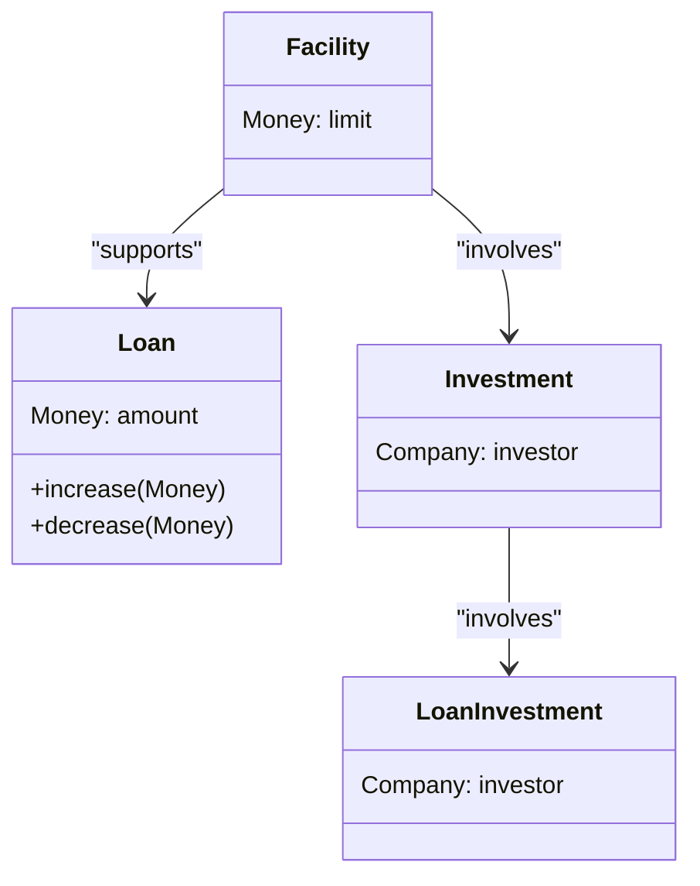
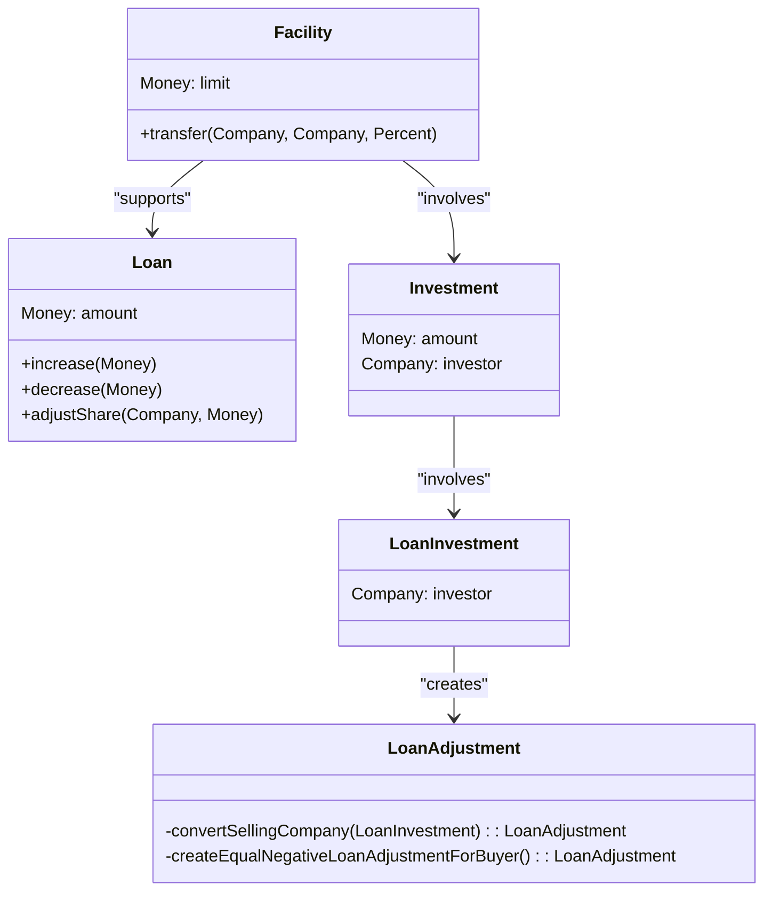
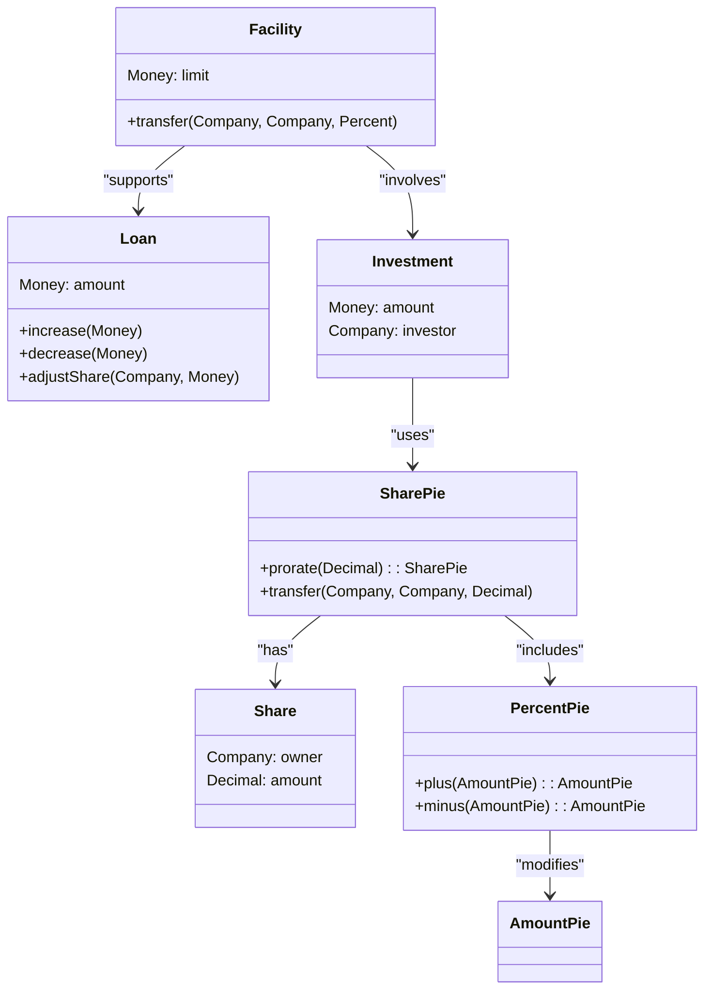
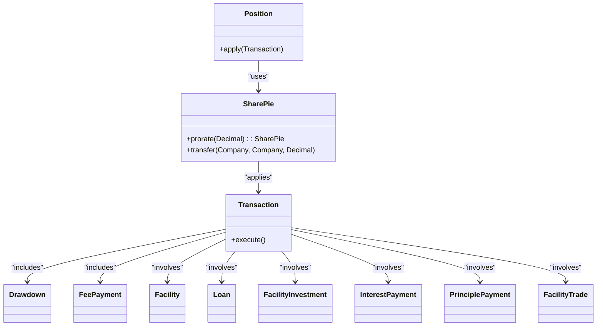

# 도약

#### 8. 돌파구

**돌파구의 시간 / 리팩토링**

리팩토링의 결과는 선형적이지 않다. 일반적으로 작은 노력으로 소소한 개선이 이루어진다. 이러한 작은 개선들이 모여 엔트로피와 싸우며, 이는 고착화된 레거시 시스템을 방지하는 가장 중요한 방어 수단이 된다.

팀은 천천히 그러나 확실하게 지식을 흡수하고 이를 모델로 압축해나간다. 깊은 모델은 작은 리팩토링, 객체 단위, 연관성 조정, 책임 전환 등을 통해 점진적으로 등장할 수 있다. 하지만 때로는 급작스럽게 변화를 겪기도 한다. 통찰력이 깊어지면 코드와 모델의 정제는 더 명확한 시야를 제공하며, 이는 돌파구의 가능성을 만든다. 변화의 물결은 사용자들의 현실과 우선순위에 더 깊이 부합하는 모델로 이어지며, 유연성과 설명력이 급격히 증가하고 복잡성은 사라진다.

**괜찮은 모델, 그러나...**

뉴욕의 긴 겨울 동안 리팩토링을 거쳐 우리는 도메인의 주요 지식을 포착하고 실제로 애플리케이션에 유용한 설계를 가진 모델에 도달했다. 우리는 투자 은행에서 신디케이트 대출을 관리하는 대규모 애플리케이션의 핵심 부분을 개발하고 있었다.

**점진적 문제 해결을 위한 모델 변화**

이러한 종류의 세부 조정은 다양한 거래 규칙이 명확해짐에 따라 우리가 따라갈 수 있게 해주었다. 그러나 복잡성이 증가하고 우리는 견고한 기능에 빠르게 수렴하지 않는 것처럼 보였다.

심지어 더욱 우려스러운 것은 점점 더 복잡한 알고리즘으로도 해결할 수 없었던 미세한 반올림 불일치였다. 1억 달러짜리 거래에서는 몇 센트의 차이가 중요하지 않을 수 있지만, 소프트웨어가 이를 철저히 처리하지 못한다면 신뢰할 수 없다. 이러한 문제들이 기본 설계 문제의 징후라고 의심하기 시작했다.

**돌파구**

어느 주 갑자기 문제가 무엇인지 깨달았다. 우리의 모델이 시설과 대출 지분을 비즈니스에 적합하지 않게 묶고 있었다. 이는 광범위한 영향을 미쳤다. 비즈니스 전문가들이 고개를 끄덕이며 열정적으로 도와주면서 우리는 새로운 모델을 화이트보드에 작성했다. 새로운 모델을 사용하여 수많은 시나리오를 검토했다.

이 다이어그램은 차용자가 1억 달러 중 처음 5천만 달러를 인출하기로 선택했음을 나타낸다. 세 대출자는 시설 지분에 정확히 비례하여 지분을 제공하여 대출이 분할된다.

**더 깊은 모델**

우리는 두 가지 깊은 통찰력을 얻었다. 첫 번째는 우리의 "투자"와 "대출 투자"가 일반적이고 기본적인 개념인 지분의 두 가지 특수 사례라는 것이다. 시설 지분, 대출 지분, 지불 분배의 지분 등 모든 곳에 지분이 있었다.

며칠간의 격동 후, 나는 공유에 대한 모델을 스케치하고 전문가들과의 논의에서 사용된 언어를 바탕으로 시나리오를 탐구했다.

**깨어난 후의 의사결정**

우리는 프로젝트 관리자와의 미팅을 가졌다. 우리의 관리자는 지능적이고 대담한 사람이었다. 그는 일련의 질문을 했다.

* Q: 새로운 설계로 현재 기능에 도달하려면 얼마나 걸릴까?
  * A: 약 3주.
* Q: 문제를 해결할 수 있을까?
  * A: 아마도. 그러나 확실하지 않다.
* Q: 만약 지금 변경하지 않으면 다음 릴리스에서 앞으로 나아갈 수 있을까?
  * A: 앞으로 나아가는 것이 더디게 될 것이다. 변경이 더 어려워질 것이다.
* Q: 우리가 올바른 일이라고 생각하는가?
  * A: 네, 장기적으로는 낮은 리스크다.

우리는 이를 수행하기로 결정하고 3주 만에 작업을 완료했다. 이는 큰 작업이었지만 놀랍도록 매끄럽게 진행되었다.

#### **보상**

갑작스러운 요구사항 변경이 멈췄다. 반올림 로직도 안정화되고 의미를 갖게 되었다. 버전 1을 전달했고, 버전 2로 가는 길이 열렸다.

#### **기회**

깊은 모델로의 돌파구는 종종 두려움을 동반한다. 이러한 변화는 대부분의 리팩토링보다 높은 기회와 높은 리스크를 가진다. 타이밍이 적절하지 않을 수 있다. 하지만 깊은 모델로의 전환은 사고의 근본적인 변화이며, 설계의 큰 변화를 요구한다.

#### **기본에 집중**

돌파구를 만들기 위해 마비되지 말라. 가능성은 보통 많은 작은 리팩토링 후에 온다. 대부분의 시간은 점진적인 개선에 쓰인다. 돌파구를 위한 무대를 마련하려면 지식 압축과 견고한 UBIQUITOUS LANGUAGE를 배양하는 데 집중하라. 중요한 도메인 개념을 찾아 모델에 명확히 나타내라.

**새로운 통찰의 연속**

그 돌파구는 우리를 어려움에서 벗어나게 했지만, 그것이 이야기의 끝은 아니었다. 깊은 모델은 애플리케이션을 더 풍부하게 만들고 설계를 더 명확하게 할 예상치 못한 기회를 열어주었다.

설계가 명확해지고 커뮤니케이션이 개선됨에 따라 또 다른 모델링 돌파구가 이어졌다. 대부분의 프로젝트가 이미 구축한 대규모와 복잡성에 의해 정체되기 시작할 시점에 우리의 개발 속도는 가속화되었다.
