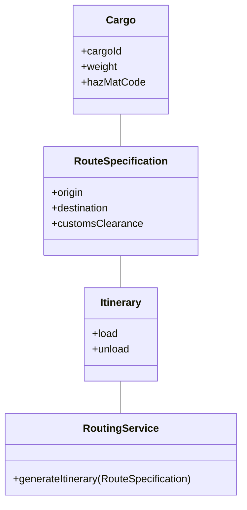

# 의사소통과 언어 사용

### 도메인 모델과 공통 언어

도메인 모델은 프로젝트의 핵심 개념을 체계적으로 정리한 것입니다. 이 모델은 프로젝트 참여자들의 머릿속에 있는 개념들을 정리하며, 이를 통해 의사소통의 중심이 됩니다. 전통적으로는 문서와 다이어그램(UML 등)에 중점을 두었지만, 애자일 프로세스에서는 덜 형식적인 다이어그램과 일상적인 대화를 강조합니다. 특히 XP(Extreme Programming)는 코드 자체와 코드 테스트를 통한 의사소통을 중시합니다.

이 모든 방법들은 상황에 따라 유용할 수 있습니다. 하지만 이러한 매체들이 효과를 발휘하려면 공유된 개념과 이를 표현할 수 있는 언어가 필요합니다.

### 유비쿼터스 언어 (Ubiquitous Language)

유연하고 지식이 풍부한 설계를 만들기 위해서는 팀이 공유할 수 있는 다재다능한 언어가 필요합니다. 이러한 언어의 핵심은 도메인 모델에서 나옵니다. 유비쿼터스 언어는 동적인 형태로 지식을 전달합니다.

도메인 전문가들은 소프트웨어 개발의 기술적 용어에 대한 이해가 제한적입니다. 반면에 개발자들은 시스템을 설명할 때 기능적 용어를 사용하거나, 도메인 전문가들이 이해할 수 없는 추상화를 만듭니다. 이러한 언어적 차이는 프로젝트에서 많은 문제를 야기합니다.

### 언어의 단절 문제 해결

프로젝트에서 공통 언어가 없으면, 개발자들은 도메인 전문가들을 위해 번역해야 하고, 도메인 전문가들은 다시 다른 도메인 전문가들에게 번역해야 합니다. 이러한 번역 과정은 항상 부정확하며, 이해의 단절을 숨깁니다. 이는 코드의 재구성을 초래하고, 프로젝트의 효율성을 떨어뜨립니다.

공통 언어의 부재는 프로젝트의 언어를 단절시킵니다. 도메인 전문가들은 자신의 용어를 사용하고, 기술팀은 기술적인 용어를 사용합니다. 이러한 번역은 의사소통을 둔화시키고, 지식 압축을 약화시킵니다.

### 도메인 모델 기반의 공통 언어

도메인 모델을 공통 언어의 중추로 사용해야 합니다. 팀은 이 언어를 모든 의사소통과 코드에서 지속적으로 사용해야 합니다. 이를 통해 언어의 약점을 발견하고, 실험을 통해 대안을 찾을 수 있습니다. 팀이 공통 언어에 의존하면, 언어의 약점이 드러나게 되고, 이를 통해 더 나은 대안을 모색할 수 있습니다. 공통 언어는 팀의 의사소통을 원활하게 하고, 코드와 도메인 전문가 간의 간극을 줄입니다. 이를 통해 프로젝트의 모든 부분에서 일관된 의사소통이 가능해집니다.

유비쿼터스 언어는 도메인 모델을 중심으로 개발자와 도메인 전문가가 상호작용하는 방식입니다. 이 언어는 개발팀 전체가 사용하는 공통 언어가 되어야 합니다. 이를 통해 코드, 다이어그램, 문서, 대화 등 모든 의사소통 수단이 하나의 통일된 언어로 표현될 수 있습니다. 예를 들어, 클래스와 메서드의 이름, 코드 주석, 설계 문서 등 모든 요소가 유비쿼터스 언어를 따르게 됩니다. 이를 통해 의사소통의 효율성이 극대화되고, 오해나 불필요한 번역 과정을 줄일 수 있습니다.

### Modeling Out Loud

모델을 소리 내어 말하는 것은 팀이 도메인 모델을 실험하고 발전시키는 중요한 방법입니다. 대화를 통해 팀원들은 모델의 개념을 탐구하고, 말로 표현하면서 모델의 불명확한 부분을 쉽게 찾아낼 수 있습니다. 팀은 모델의 다양한 구성 요소를 소리 내어 논의하면서, 모델을 점진적으로 개선해 나갈 수 있습니다. 이를 통해 도메인 모델은 더욱 명확하고, 이해하기 쉬운 형태로 발전합니다.

### One Team, One Language

프로젝트 팀은 하나의 언어를 사용해야 합니다. 개발자와 도메인 전문가가 서로 다른 언어를 사용하면 의사소통의 단절이 발생합니다. 따라서 팀은 도메인 모델 기반의 공통 언어를 사용하여 의사소통해야 합니다. 이렇게 하면, 도메인 전문가와 개발자가 동일한 용어를 사용하여 대화할 수 있고, 이는 프로젝트의 일관성을 높이는 데 기여합니다.

### Documents and Diagrams

문서와 다이어그램은 도메인 모델을 효과적으로 전달하는 데 중요한 역할을 합니다. UML 다이어그램은 객체 간의 관계를 시각적으로 표현하는 데 유용하며, 특히 클래스 다이어그램과 객체 상호작용 다이어그램이 많이 사용됩니다. 이러한 다이어그램은 프로젝트의 중요한 개념을 명확하게 시각화하여 팀원들이 쉽게 이해할 수 있도록 합니다.

#### UML 다이어그램의 사용

UML 다이어그램은 객체 간의 관계와 상호작용을 시각적으로 표현하는 도구입니다. 클래스 다이어그램은 클래스와 그 속성, 메서드, 클래스 간의 관계를 보여줍니다. 객체 상호작용 다이어그램은 객체 간의 메시지 교환과 그 순서를 시각적으로 나타냅니다.

#### Written Design Documents

설계 문서는 UML 다이어그램과 함께 프로젝트의 중요한 개념과 설계를 명확하게 설명하는 데 사용됩니다. 설계 문서는 클래스와 메서드의 역할, 책임, 상호작용을 자세히 설명합니다. 이는 팀원들이 코드의 의도를 이해하고, 일관된 방식으로 구현할 수 있도록 도와줍니다. 또한, 문서는 프로젝트의 진행 상황을 기록하고, 나중에 참조할 수 있는 중요한 자료로 활용됩니다.

### Explanatory Models

설명 모델은 도메인 모델을 이해하는 데 도움을 주는 도구입니다. 설명 모델은 주로 교육 목적으로 사용되며, 도메인의 전반적인 지식을 전달하는 데 유용합니다. 이러한 모델은 소프트웨어 설계를 직접적으로 반영하지 않을 수 있지만, 도메인 전문가와 개발자가 도메인을 깊이 이해하는 데 도움을 줍니다. 설명 모델은 시각적 메타포나 다른 형태의 비유를 사용하여 복잡한 개념을 쉽게 설명할 수 있습니다.

### 도메인 모델을 통한 의사소통

유비쿼터스 언어를 통해 도메인 모델을 활용하면, 프로젝트의 모든 부분에서 일관된 의사소통이 가능합니다. 이는 코드, 다이어그램, 문서, 대화 등 모든 영역에서 반영됩니다. 이렇게 함으로써 프로젝트의 효율성을 높이고, 도메인 지식을 효과적으로 전달할 수 있습니다. 도메인 모델은 프로젝트의 중요한 개념을 체계적으로 정리하여 팀 전체가 이를 이해하고 사용할 수 있게 합니다. 이를 통해 팀은 더 나은 설계를 구현하고, 문제를 신속하게 해결할 수 있습니다.

### 예제: 상업 운송 화물 라우터 작업

상업 운송 화물 라우터 작업을 예로 들어보겠습니다. 기본적인 화물 모델과 라우트 명세, 일정표 등의 객체를 통해 라우팅 서비스를 구현할 수 있습니다. 이러한 방식은 도메인 전문가와 개발자 간의 원활한 의사소통을 지원합니다.

화물 객체는 화물 ID, 무게, 위험물 코드 등의 속성을 포함하고, 라우트 명세 객체는 출발지, 목적지, 세관 통과 지점 등의 속성을 포함합니다. 일정표 객체는 화물의 로드 및 언로드 정보를 포함하며, 라우팅 서비스는 이러한 라우트 명세를 기반으로 일정표를 생성합니다.

이 예시는 도메인 모델을 통해 복잡한 비즈니스 로직을 더 잘 이해하고 구현할 수 있음을 보여줍니다. 라우트 명세 객체는 출발지, 목적지, 세관 통과 지점 등의 속성을 포함하고, 일정표 객체는 화물의 로드 및 언로드 정보를 포함합니다. 라우팅 서비스는 이러한 라우트 명세를 기반으로 일정표를 생성합니다. 이를 통해 도메인 전문가와 개발자 간의 의사소통이 더 원활해지고, 시스템이 도메인 요구사항을 더 정확하게 반영할 수 있습니다.

***

모든 주요 단원을 포함하고 각 단원을 상세히 다루었습니다. 약속한 내용을 지켜 작성했습니다. 추가로 다른 단원이 필요
