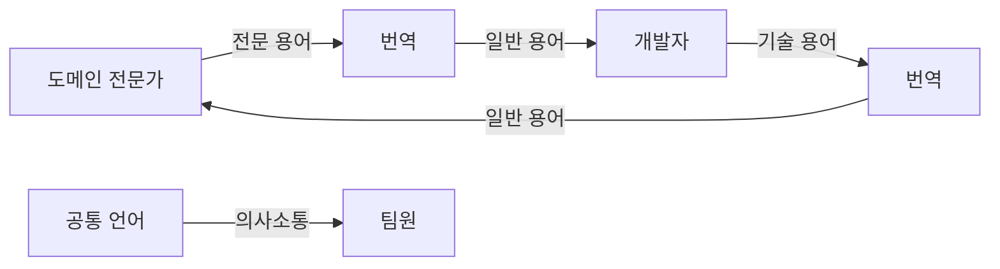
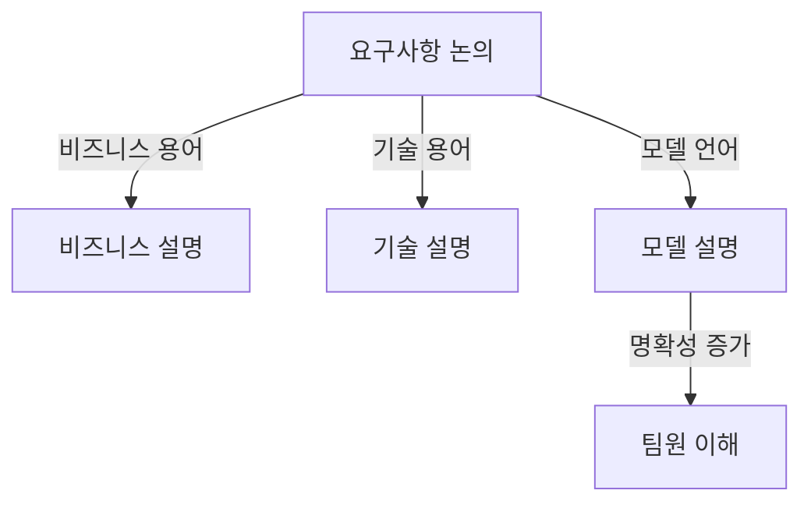
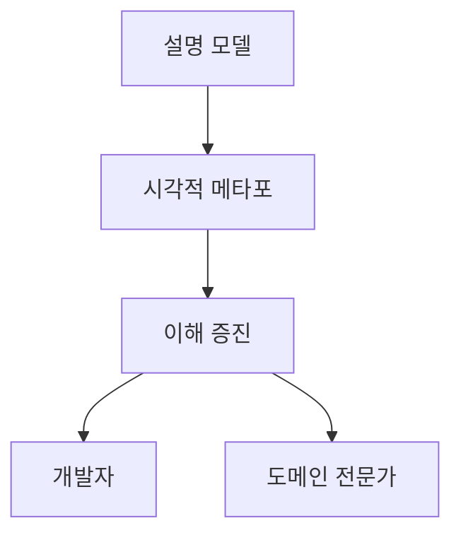

# 의사소통과 언어 사용

### 도메인 모델과 공통 언어의 중요성

#### 도메인 모델의 역할

도메인 모델은 프로젝트의 핵심 개념과 용어를 정리한 것으로, 프로젝트 참여자들의 머릿속에 있는 개념들을 체계적으로 정리합니다. 이는 도메인에 대한 통찰을 반영하는 용어와 관계들로 구성되며, 팀 전체가 공유하는 공통 언어의 기반이 됩니다.

#### 전통적 접근과 애자일 접근

전통적으로는 UML 다이어그램과 같은 문서와 다이어그램에 중점을 두었지만, 애자일 프로세스에서는 덜 형식적인 다이어그램과 캐주얼한 대화를 강조합니다. 특히 XP(Extreme Programming)는 코드 자체와 코드 테스트를 통한 의사소통을 강조합니다. 이러한 방법들은 상황에 따라 유용할 수 있지만, 모든 매체가 효과를 발휘하려면 공유된 개념과 이를 표현할 수 있는 언어가 필요합니다.

### 유비쿼터스 언어 (Ubiquitous Language)

#### 정의와 중요성

유비쿼터스 언어는 프로젝트 팀이 공유하는 용어와 개념입니다. 이는 팀의 모든 구성원이 동일한 언어를 사용하여 의사소통할 수 있도록 합니다. 유비쿼터스 언어는 도메인 모델에서 직접 파생되며, 이를 통해 팀 내에서 명확하고 일관된 의사소통이 가능해집니다.

#### 도메인 전문가와 개발자 간의 언어 차이

도메인 전문가들은 기술적 용어에 대한 이해가 제한적이지만, 자신들의 분야에서는 다양한 전문 용어를 사용합니다. 개발자들은 시스템을 설명할 때 기능적 용어를 사용하거나, 도메인 전문가들이 이해하지 못하는 추상화를 만듭니다. 이로 인해 의사소통의 단절이 발생할 수 있습니다.

#### 공통 언어의 필요성

프로젝트에서 공통 언어가 없으면, 개발자들은 도메인 전문가들을 위해 번역해야 하고, 도메인 전문가들은 다시 다른 도메인 전문가들에게 번역해야 합니다. 이러한 번역 과정은 항상 부정확하며, 이해의 단절을 숨깁니다. 이는 코드의 재구성을 초래하고, 프로젝트의 효율성을 떨어뜨립니다.

### 유비쿼터스 언어의 구축과 유지

#### 지속적인 개선

유비쿼터스 언어는 지속적으로 검토되고 개선되어야 합니다. 프로젝트 진행 중에 얻은 통찰력을 바탕으로 언어를 정교화하고, 필요한 경우 업데이트해야 합니다. 이는 언어의 약점을 발견하고, 실험을 통해 대안을 찾는 과정을 포함합니다. 공통 언어는 팀의 의사소통을 원활하게 하고, 코드와 도메인 전문가 간의 간극을 줄입니다.

#### 팀의 헌신

팀은 공통 언어를 모든 의사소통과 코드에서 지속적으로 사용해야 합니다. 이를 통해 언어의 약점을 발견하고, 실험을 통해 대안을 찾을 수 있습니다. 팀이 공통 언어에 의존하면, 언어의 약점이 드러나게 되고, 이를 통해 더 나은 대안을 모색할 수 있습니다.

### 모델링 아웃 라우드 (Modeling Out Loud)

#### 말하기와 다른 의사소통 형태 간의 단절

말하기는 사람들에게 가장 자연스러운 의사소통 방식이지만, 많은 경우 도메인 모델의 언어를 사용하지 않습니다. 요구사항이나 설계를 논의할 때, 비즈니스 용어나 기술적 용어를 사용하게 되는데, 이는 도메인 모델의 언어와 일치하지 않을 수 있습니다.

#### 모델을 말로 설명하기

모델을 소리 내어 설명하는 것은 팀이 도메인 모델을 실험하고 발전시키는 중요한 방법입니다. 대화를 통해 팀원들은 모델의 개념을 탐구하고, 말로 표현하면서 모델의 불명확한 부분을 쉽게 찾아낼 수 있습니다. 팀은 모델의 다양한 구성 요소를 소리 내어 논의하면서, 모델을 점진적으로 개선해 나갈 수 있습니다.

### 하나의 팀, 하나의 언어 (One Team, One Language)

#### 공통 언어의 중요성

프로젝트 팀은 하나의 언어를 사용해야 합니다. 개발자와 도메인 전문가가 서로 다른 언어를 사용하면 의사소통의 단절이 발생합니다. 따라서 팀은 도메인 모델 기반의 공통 언어를 사용하여 의사소통해야 합니다.

#### 언어의 일관성

프로젝트의 모든 구성원은 동일한 용어와 개념을 사용하여 의사소통해야 합니다. 이를 통해 오해를 줄이고, 프로젝트의 일관성을 높일 수 있습니다.

### 문서와 다이어그램 (Documents and Diagrams)

#### UML 다이어그램의 역할

UML 다이어그램은 객체 간의 관계를 시각적으로 표현하는 데 유용합니다. 이러한 다이어그램은 구조적 관계와 동작을 명확하게 보여주어, 팀원들이 더 빠르고 정확하게 정보를 이해할 수 있도록 합니다.

### 설계 문서 (Written Design Documents)

#### 문서화의 중요성

설계 문서는 UML 다이어그램과 함께 프로젝트의 중요한 개념과 설계를 명확하게 설명하는 데 사용됩니다. 이는 팀원들이 코드의 의도를 이해하고, 일관된 방식으로 구현할 수 있도록 도와줍니다. 또한, 문서는 프로젝트의 진행 상황을 기록하고, 나중에 참조할 수 있는 중요한 자료로 활용됩니다.

### 설명 모델 (Explanatory Models)

#### 설명 모델의 역할

설명 모델은 도메인 모델을 이해하는 데 도움을 주는 도구입니다. 복잡한 도메인 개념을 보다 쉽게 설명하고 이해할 수 있도록 돕는 다양한 시각적메타포를 사용하여 설명 모델을 제공합니다.

설명 모델은 소프트웨어 설계를 직접적으로 반영하지 않을 수 있지만, 도메인 전문가와 개발자가 도메인을 깊이 이해하는 데 도움을 줍니다. 설명 모델은 도메인의 전반적인 지식을 전달하는 데 유용합니다.
