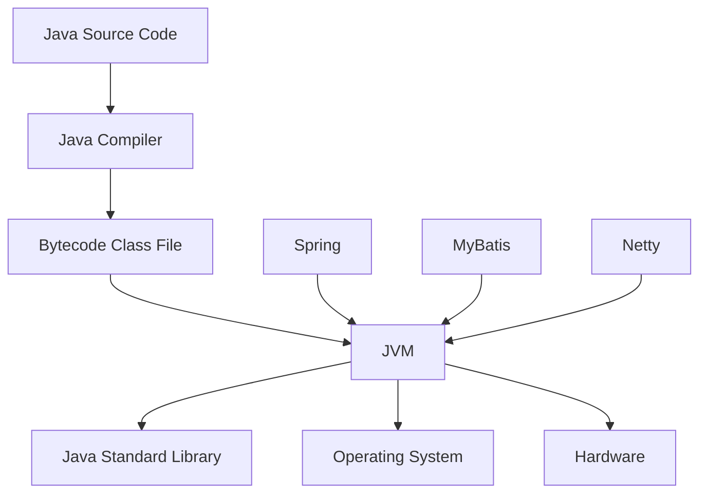
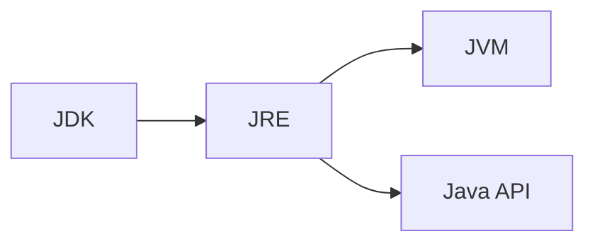
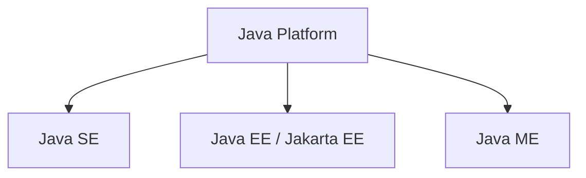

# Java 기술 체계

Java를 단순한 프로그래밍 언어로 생각하기 쉽지만, 실제로 Java는 여러 구성 요소가 결합된 거대한 기술 생태계이다.

오늘날 우리가 "Java를 사용한다"고 말할 때는 단순히 Java 언어만을 의미하지 않는다. Java 프로그램을 작성하기 위한 언어, 프로그램을 실행하는 가상 머신, 다양한 기능을 제공하는 표준 라이브러리, 그리고 수많은 오픈소스 프레임워크까지 모두 Java 기술 체계의 일부라고 볼 수 있다.

Java 기술을 올바르게 이해하기 위해서는 먼저 Java 플랫폼을 구성하는 핵심 요소들을 살펴볼 필요가 있다.

#### Java 기술 체계의 구성 요소

전통적인 관점에서 Java 기술 체계는 다음과 같은 요소들로 구성된다.

* Java 프로그래밍 언어
* Java Virtual Machine(JVM)
* Class File Format
* Java 표준 라이브러리(API)
* 서드파티 라이브러리 및 프레임워크

이들의 관계를 간단히 표현하면 다음과 같다.

개발자는 Java 언어로 소스 코드를 작성한다.

컴파일러는 이를 바이트코드(Bytecode) 형태의 Class 파일로 변환한다.

그리고 JVM은 이 바이트코드를 읽고 실행하면서 운영체제와 하드웨어의 차이를 추상화한다.

덕분에 동일한 프로그램을 Windows, Linux, macOS 등 서로 다른 환경에서도 실행할 수 있다.

***

#### JDK와 JRE

Java를 공부하다 보면 가장 먼저 마주치는 용어가 JDK와 JRE이다.

많은 초보 개발자들이 두 용어를 혼동하지만 역할은 분명히 다르다.

**JDK (Java Development Kit)**

JDK는 Java 프로그램을 개발하기 위한 환경이다.

여기에는 다음과 같은 구성 요소가 포함된다.

* javac (컴파일러)
* java (실행기)
* javadoc
* jdb
* JVM
* Java 표준 라이브러리

즉, 개발자가 코드를 작성하고 컴파일하고 실행하는 데 필요한 모든 도구가 포함되어 있다.

**JRE (Java Runtime Environment)**

JRE는 Java 프로그램을 실행하기 위한 환경이다.

JDK에서 개발 도구를 제외한 실행 환경만 포함한다.

과거에는 다음과 같은 구조로 이해할 수 있었다.

즉,

* JDK = 개발 환경
* JRE = 실행 환경

이라고 이해하면 된다.

***

#### Java 플랫폼의 제품군

Java 기술은 사용 목적에 따라 여러 플랫폼으로 나뉘어 발전해 왔다.

대표적으로 다음과 같은 세 가지 플랫폼이 존재한다.

**Java SE**

Java Standard Edition의 약자이다.

일반적인 Java 애플리케이션 개발의 기반이 된다.

우리가 흔히 사용하는 Java 언어와 JVM, Collection Framework, I/O API 등이 모두 Java SE에 포함된다.

**Java EE**

Java Enterprise Edition의 약자이다.

대규모 엔터프라이즈 애플리케이션 개발을 위해 만들어졌다.

웹 애플리케이션, 트랜잭션 처리, 분산 시스템 개발을 위한 다양한 기술을 제공하였다.

현재는 Oracle에서 Eclipse Foundation으로 이관되면서 Jakarta EE라는 이름으로 발전하고 있다.

**Java ME**

Java Micro Edition의 약자이다.

과거 휴대전화나 임베디드 장치와 같이 제한된 환경에서 Java를 실행하기 위해 만들어졌다.

현재는 과거만큼 큰 영향력을 가지지는 않지만 Java 플랫폼 발전 과정에서 중요한 역할을 담당했다.

이를 그림으로 표현하면 다음과 같다.

***

#### JVM은 Java 기술의 중심이다

Java 기술 체계를 구성하는 요소는 많지만, 그 중심에는 JVM이 존재한다.

Java 언어가 발전할 수 있었던 이유도, 다양한 운영체제를 지원할 수 있었던 이유도, 높은 생산성과 안정성을 제공할 수 있었던 이유도 결국 JVM 덕분이다.

따라서 Java를 깊이 이해하기 위해서는 JVM을 이해해야 한다.

그리고 JVM을 이해하기 위해서는 먼저 Java가 어떤 과정을 거쳐 지금의 모습으로 발전했는지 살펴볼 필요가 있다.

다음 절에서는 Java가 탄생한 배경부터 현재에 이르기까지의 발전 과정을 시간순으로 살펴보겠다.
