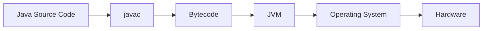

# 개요

### 1.1 개요

Java는 단순한 프로그래밍 언어가 아니다. Java는 프로그래밍 언어를 중심으로 가상 머신, 표준 라이브러리, 개발 도구, 그리고 수많은 서드파티 프레임워크가 결합된 하나의 기술 체계이다.

오늘날 Java는 웹 애플리케이션, 엔터프라이즈 서버, 모바일 기기, 임베디드 장치 등 다양한 환경에서 활용되고 있다. 수많은 기업의 핵심 서비스가 Java를 기반으로 구축되어 있으며, 전 세계적으로 가장 널리 사용되는 개발 플랫폼 중 하나로 자리 잡고 있다.

Java가 오랫동안 높은 인기를 유지할 수 있었던 이유는 여러 가지가 있다.

대표적으로 Java는 하드웨어와 운영체제의 차이를 추상화하여 플랫폼 독립성을 제공한다. 또한 자동 메모리 관리 기능을 통해 개발자가 메모리 해제와 같은 저수준 작업에 신경 쓰지 않고 비즈니스 로직 구현에 집중할 수 있도록 돕는다. 여기에 풍부한 표준 라이브러리와 지속적인 성능 최적화 기술이 더해지면서 Java는 생산성과 안정성을 동시에 확보할 수 있었다.

Java 프로그램이 실행되는 과정을 단순화하면 다음과 같이 표현할 수 있다.

개발자가 작성한 Java 소스 코드는 컴파일 과정을 거쳐 바이트코드(Bytecode)로 변환된다. 이후 JVM(Java Virtual Machine)이 바이트코드를 해석하거나 컴파일하여 실제 하드웨어에서 실행할 수 있는 형태로 변환한다.

이 구조는 Java 기술의 가장 중요한 특징 중 하나이다. 동일한 바이트코드는 서로 다른 운영체제와 하드웨어 환경에서도 JVM만 존재한다면 동일하게 실행될 수 있다. Java의 대표적인 철학인 _Write Once, Run Anywhere_ 역시 이러한 구조를 기반으로 한다.

하지만 Java 기술의 진정한 강점은 단순히 플랫폼 독립성에만 있는 것이 아니다.

현대의 JVM은 메모리 관리, 가비지 컬렉션, 클래스 로딩, 동적 컴파일, 스레드 관리 등 다양한 기능을 수행한다. 개발자는 이러한 기능들을 직접 구현하지 않고도 안정적인 애플리케이션을 개발할 수 있다.

대부분의 경우 개발자는 Java 언어와 라이브러리만으로도 충분히 프로그램을 작성할 수 있다. 그러나 시스템 규모가 커지고 성능과 안정성이 중요한 요구사항이 되면 JVM 내부 동작 원리에 대한 이해가 필요해진다.

예를 들어 메모리 부족 문제, 과도한 가비지 컬렉션, 응답 속도 저하, 스레드 병목 현상과 같은 문제들은 모두 JVM의 동작 방식과 밀접한 관련이 있다. 이러한 문제를 분석하고 해결하기 위해서는 JVM이 프로그램을 어떻게 실행하고 관리하는지 이해해야 한다.

이 책은 Java 기술 체계를 구성하는 핵심 요소들을 살펴보고, JVM 내부 구조와 동작 원리를 단계적으로 분석하는 것을 목표로 한다. 이를 통해 Java 프로그램이 실제로 어떤 과정을 거쳐 실행되는지, 그리고 JVM이 성능과 안정성을 위해 어떤 역할을 수행하는지 이해할 수 있을 것이다.

다음 절에서는 Java 기술 체계를 구성하는 요소들과 JDK, JRE, JVM의 관계를 살펴보며 Java 플랫폼의 전체 구조를 이해해보도록 하겠다.
