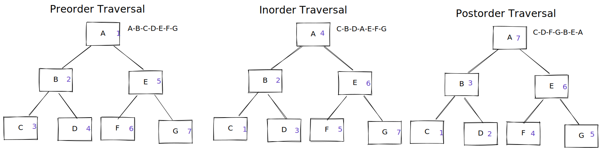

# Callable

Runnable과 유사하지만 Callable은 반환값을 가집니다.

### Callable

```java
public interface Callable<V> {
    V call() throws Exception;
}
```

Callable은 선언한 객체를 리턴해 줍니다.\
`Thead에는 FutureTask`와 함께 사용하고, `Executor`에는 그대로 사용하면 됩니다



Thread이 시작되면 Callable에 작업 전달을 하고 응답 값은 future나 futrueTask에 전달이 됩니다.

Main Thread에서 값을 꺼낼때는 Callable에서 받아온 Future\&FutureTast의 응답값을 주게 됩니다.

#### Thead

```java
public class CallableWithThead implements Callable<String> {
    @Override
    public String call() throws Exception {
        return "I'm Callable";
    }
}

public class Main {
    public static void main(String[] args) {
        FutureTask<String> futureTask = new FutureTask<String>(new CallableWithThead());
        Thread thread = new Thread(futureTask);
        String result = futureTask.get();
    }
}
```

Executor

```java
public class CallableWithExecutor implements Callable<String> {
    @Override
    public String call() throws Exception {
        return "I'm Callable";
    }
}

public class Main {
    public static void main(String[] args) {
        ExecutorService executor = Executors.newSingleThreadExecutor();
        Future<String> future = executor.submit(new CallableWithExecutor());
        String result = future.get();
    }
}
```

### Improve Future

향상된 Future엔 CompletableFuture 가 존재한다.

runAsnyc : return X\
supplyAsync : return 0 \
두가지로 작업을 실행할 수 있다.

```java
public class CallbackSupplier implements Supplier<String> {
    @Override
    public String get() {
        return "I'm Supplier";
    }
}
public class CallbackRunnable implements Runnable {
    @Override
    public void run() {
        System.out.println("I'm Runnable");
    }
}

public class Main {
    public static void main(String[] args) {
        CompletableFuture<Void> runAsync = CompletableFuture.runAsync(new CallbackRunnable());
        CompletableFuture<String> supplyAsync = CompletableFuture.supplyAsync(new CallbackSupplier());

        Void noResult = runAsync.get();
        String result = supplyAsync.get();
    }
}

```

추가적으로 CompleteFuture에는 thenApply, thenAccept, thenRun을 사용하여작업을 연결해 줄 수 있다.

```java
CompletableFuture<Void> runAsync = CompletableFuture.runAsync(new CallbackRunnable())
        .thenRunAsync(new CallbackRunnable());
CompletableFuture<String> supplyAsync = CompletableFuture.supplyAsync(new CallbackSupplier())
        .thenApply(s -> s + " and thenApply")
        .completeAsync(() -> "I'm completeAsync")
        .exceptionallyAsync(throwable -> "I'm exceptionallyAsync");

Void noResult = runAsync.get();
String result = supplyAsync.get();
```

thenCompose, thenCombine   으로 작업을 조합할 수도 있다.

```java
CompletableFuture<String> supplyAsync = CompletableFuture.supplyAsync(new CallbackSupplier())
  .thenCombineAsync(CompletableFuture.supplyAsync(new CallbackSupplier()), (s1, s2) -> s1 + s2)
  .thenComposeAsync(s -> CompletableFuture.supplyAsync(() -> s + " and thenComposeAsync"));
```

\
지금 까지와 동일한[ Printer](process.md#thread)를 예제로 사용

### How do code?


