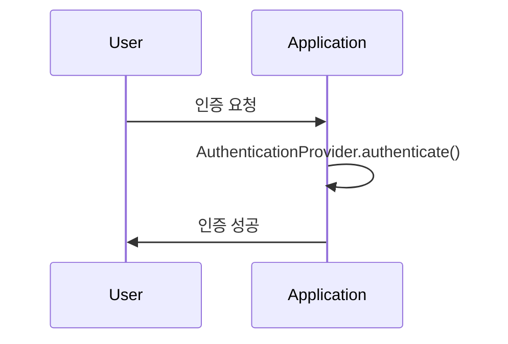

# 인증 구현

인증 논리를 담당하는 것은 AuthenticationProvider이다. 이 인터페이스를 구현한 클래스를 만들어서 사용하면 된다. 인증 프로세스는 두가지의 경우로 이루어진다.

```kotlin
1. 요청한 엔티티가 인증되지 않은 경우
2. 요청한 엔티티가 인증된 경우
```

요청을 나타내는 방법을 이해하려면 Authentication 객체를 이해해야 한다. 이 객체는 요청한 엔티티의 정보를 담고 있다. 이 객체는 인증 프로세스를 통과한 후에도 사용된다.

## AuthenticationProvider

서비스에 따라 아이디&비밀번호 기반의 인증이 적합하지 않을수있다.


### 인증 프로세스

Authentication은 인증 프로세스의 필수 인터페이스이다. 인증 요청 이벤트를 나타내며, 어플리케이션에 접근을 요청한 엔티티의 정보를 담고있다.

어플리케이션에 접근을 요청하는 사용자를 principal이라고 한다.



Autenticaion의 인터페이스는 다음과 같다.

```java
public interface Authentication extends Principal, Serializable {
    Collection<? extends GrantedAuthority> getAuthorities();
    Object getCredentials(); // 비밀번호나 인증 토큰
    Object getDetails(); 
    Object getPrincipal();
    boolean isAuthenticated(); // 인증된 사용자인지 확인
    void setAuthenticated(boolean isAuthenticated) throws IllegalArgumentException;
}
```

#### Custom 인증 프로세스

```java
public interface AuthenticationProvider {
    Authentication authenticate(Authentication authentication) throws AuthenticationException;
    boolean supports(Class<?> authentication);
}
```

에서 `authenticate()`는 인증을 수행하고, `supports()`는 특정 Authentication 객체를 지원하는지 확인한다.

```kotlin
@Component
class CustomAuthenticationProvider(
    private val userDetailsService: UserDetailsService,
    private val passwordEncoder: PasswordEncoder
) : AuthenticationProvider {
    override fun authenticate(authentication: Authentication?): Authentication {
        authentication?.let {
            val username = it.name
            val password = it.credentials.toString()
            val userDetails = userDetailsService.loadUserByUsername(username)
            if (passwordEncoder.matches(password, userDetails.password)) {
                return UsernamePasswordAuthenticationToken(userDetails, password, userDetails.authorities)
            }
            throw BadCredentialsException("Invalid password")
        }
            ?: throw BadCredentialsException("Invalid username")
    }

    override fun supports(autenticationType: Class<*>): Boolean = autenticationType == UsernamePasswordAuthenticationToken::class.java
}
```

## SecurityContext

`SecurityContext`는 `Authentication`을 저장하고 관리하는 인터페이스이다. \
요청이 유지되는 동안 인증된 사용자의 정보를 저장한다.


```java


