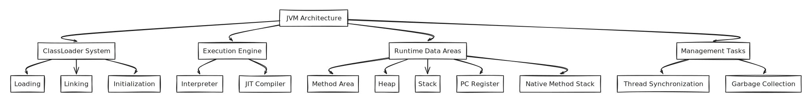

# 필터 구현

스프링 시큐리티에서 HTTP필터는 HTTP요청에 적용되는 다양한 책임을 위임한다.


FilterChain을 통해 다양한 요구사항별 필터를 적용할 수 있다.

## Filter Chain 구현

필터를 만드려면 일반적으로 Servlet Filter를 구현한다. 다른 필터와 마찬가지로 `doFilter`메서드를 구현한다.

* serveltRequest : HTTP요청
* servletResponse : HTTP응답
* filterChain : 다음 필터로 요청을 전달하는데 사용

필터 체인은 필터가 작동하는 순서가 정의된 필터의 모음을 나타낸다.

* BasicAuthenticationFilter : HTTP Basic 인증을 처리하는 필터
* CsrfFilter : CSRF 공격을 방어하는 필터
* CorsFilter : CORS를 처리하는 필터



## 기존 필터에 필터 추가

모든 요청에 `JUNNYLAND`헤더가 있는지 확인하는 필터를 추가한다.


<details markdown="1">
  <summary> CustomFilter </summary>

```kotlin
private const val KEY: String = "JUNNYLAND"

class CustomFilter : Filter {
    private val logger = LoggerFactory.getLogger(CustomFilter::class.java)
    override fun doFilter(request: ServletRequest, response: ServletResponse, filter: FilterChain) {
        logger.info("custom doFilter")
        (request as HttpServletRequest)
            .getHeader("JUNNYLAND")
            ?.takeIf { it == KEY }
            ?.let { filter.doFilter(request, response) }
            ?: (response as HttpServletResponse).setStatus(HttpServletResponse.SC_UNAUTHORIZED)
    }₩
}
```
</details>

<details markdown="1">
  <summary> SecurityConfiguration </summary>

```kotlin
@Bean
    fun securityFilterChain(http: HttpSecurity): SecurityFilterChain = http
        .addFilterBefore(CustomFilter(), BasicAuthenticationFilter::class.java) // before BasicAuthenticationFilter 전에 필터를 추가 한다
        .addFilterAfter(CustomFilter(), BasicAuthenticationFilter::class.java) // after BasicAuthenticationFilter 후에 필터를 추가 한다
        .build()
```
</details>

## 필터를 다른 필터 위치에 추가

다른 필터 위치에 맞춤형 필터를 추가하는 방식이다.
HttpBasic 인증 흐름 대신 다른 인증을 사용하는 경우를 예시로 사용한다

- 인증을 위한 정적 헤더 값에 기반을 둔 식별
- 대칭 키를 사용한 요청 서명
- OTP를 사용한 인증

<details markdown="1">
  <summary> Setting </summary>

```kotlin
private const val KEY: String = "JUNNYLAND"

@Component
class CustomFilter : Filter {
    private val logger = LoggerFactory.getLogger(CustomFilter::class.java)
    override fun doFilter(request: ServletRequest, response: ServletResponse, filter: FilterChain) {
        logger.info("custom doFilter")
        val httpRequest = request as HttpServletRequest
        httpRequest.getHeader("JUNNYLAND")
            ?.takeIf { it == KEY }
            ?.let { filter.doFilter(request, response) }
            ?: (response as HttpServletResponse).setStatus(HttpServletResponse.SC_UNAUTHORIZED)
    }
}

@Configuration
@EnableWebSecurity
class SecurityConfiguration(
    private val customFilter: CustomFilter
) {


    @Bean
    fun securityFilterChain(http: HttpSecurity): SecurityFilterChain = http
        .addFilterAt(customFilter, BasicAuthenticationFilter::class.java)
        .build()
}
```
</details>

## 스프링 시큐리티가 제공하는 필터

스프링 시큐리티는 다양한 필터를 제공한다.

- `OncePerRequestFilter` : 한번만 요청을 처리하는 필터
- `GenericFilterBean` : 일반적인 필터
- 