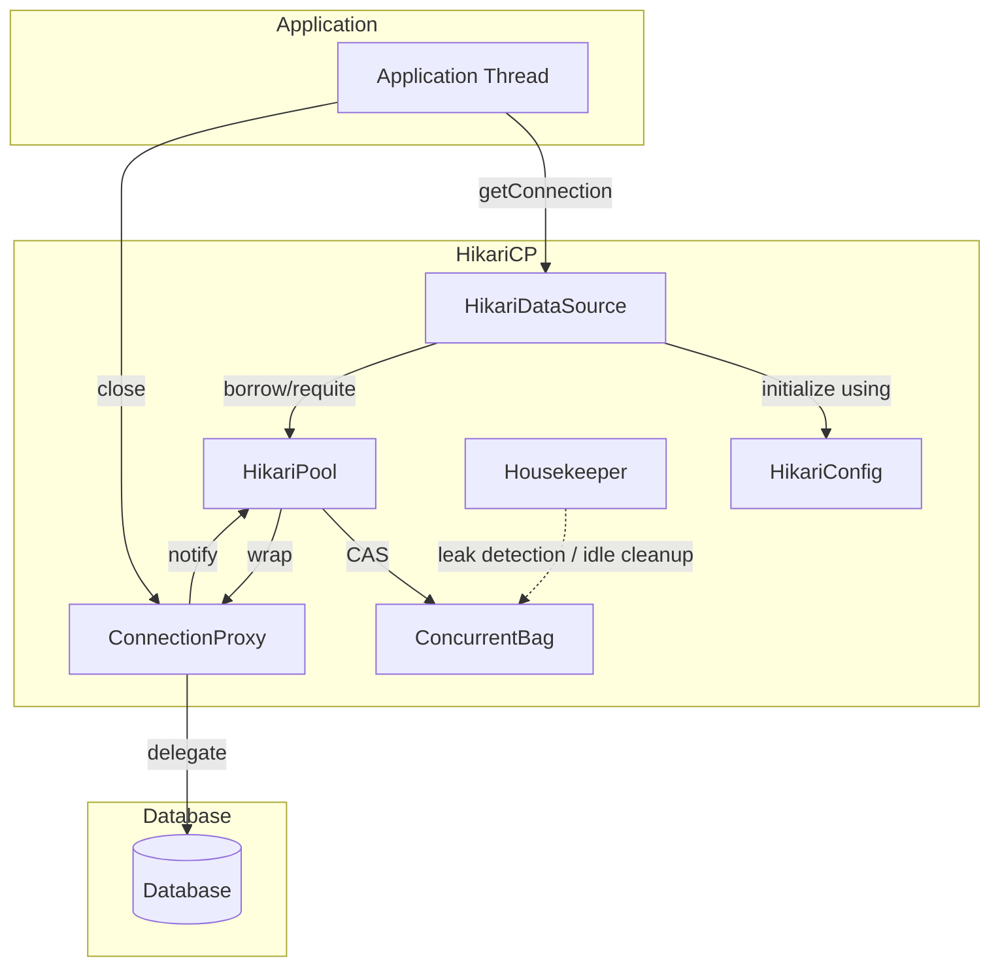

# HikariCP 소개 및 아키텍처

HikariCP 탄생 배경 및 필요성

2000년대 초 Java EE 기반 웹 애플리케이션이 보편화되면서, 매 요청마다 JDBC 커넥션을 생성·해제하는 방식은 다음과 같은 한계를 드러냈습니다:

* **지연 시간 증가**: TCP 핸드셰이크와 드라이버 초기화로 인해 요청당 수십\~수백 밀리초 지연 발생
* **DB 자원 낭비**: 짧은 수명 커넥션이 폭증하면 데이터베이스 스레드·메모리·소켓 디스크립터 고갈 우려
* **확장성 한계**: 동시 사용자 수가 증가할수록 커넥션 생성 경쟁으로 처리량 정체 발생

이에 Brett Wooldridge는 “제로 오버헤드(Zero‑Overhead)” 철학 아래 **최소 코드**·**락프리 동시성**·**단일 하우스키핑 스레드**라는 설계 원칙을 적용해 2013년 HikariCP를 개발했습니다.

***

### HikariCP 구조 개요

HikariCP는 5가지 주요 컴포넌트로 구성됩니다:

1. **HikariConfig**: 사용자 설정 및 검증
2. **HikariDataSource**: 애플리케이션에 `DataSource` 인터페이스 제공
3. **HikariPool**: 커넥션 생명 주기 및 풀 관리
4. **ConcurrentBag**: 락프리 CAS 기반 슬롯 저장소
5. **Housekeeper**: 누수 탐지·유휴 정리 백그라운드 스레드
6. **ConnectionProxy**: 실제 `Connection` 사용 위임 및 반납 가로채기



* **HikariConfig**: JDBC URL, 사용자명, 패스워드, 풀 크기·타임아웃 등 설정 보관 및 `validate()`로 검증.
* **HikariDataSource**: `DataSource.getConnection()` 호출 진입점이며, `HikariPool`과 설정 연결.
* **HikariPool**: `ConcurrentBag`으로부터 슬롯을 빌리고, 최대 풀 크기 내에서 신규 연결 생성·반환.
* **ConcurrentBag**: `AtomicReferenceArray<ConnectionWrapper>`와 CAS 연산으로 슬롯 상태 관리.
* **ConnectionProxy**: 애플리케이션에는 프록시를 전달해 `close()` 시 실제 종료 대신 풀로 반환.
* **Housekeeper**: 단일 스레드로 주기적 누수 탐지(`leakDetectionThreshold`)·유휴 정리(`idleTimeout`).

***

### 아키텍처 설계 배경 및 이유

1. **성능 극대화**: 빈번한 커넥션 생성·해제로 인한 지연 최소화
2. **안정성 확보**: `maximumPoolSize`로 DB 과부하 방지, 자동 누수 탐지·유휴 정리
3. **유지보수 단순화**: KISS·YAGNI 원칙을 지켜 경량 코드베이스 유지

***

### 설계 원칙과 대응 전략

#### 1. 락프리 CAS 기반 동시성 제어

* **원칙**: 락 대신 CAS로 상태 전환해 경합 최소화
* **어려움 & 대응**:
  * ABA 문제: 상태 + 버전 필드 사용해 예방
  * 무한 스핀: `Thread.onSpinWait()`으로 짧은 스핀 후 컨텍스트 스위치 유도
  * 공정성: 슬롯 순회 및 랜덤 오프셋 기법으로 접근 기회 분산

```java
// borrow() 핵심
for (int i = 0; i < maxSlots; i++) {
  ConnectionWrapper cw = slots.get(i);
  if (cw.state == FREE
      && cw.stateUpdater.compareAndSet(cw, FREE, RESERVED)) {
    cw.usageStart = System.nanoTime();
    return cw;
  }
}
Thread.onSpinWait();
```

#### 2. 단일 하우스키핑 스레드

* **원칙**: 백그라운드 오버헤드 최소화
* **어려움 & 대응**:
  * 장애 복원: `scheduleWithFixedDelay` + 내부 예외 핸들링
  * 타이밍 편차: 메트릭 수집으로 실제 실행 간격 모니터링

```java
exec.scheduleWithFixedDelay(() -> {
  try { housekeeping(); }
  catch (Throwable t) { log.error("Recovering", t); }
}, 30_000, 30_000, TimeUnit.MILLISECONDS);
```

#### 3. 최소 코드 베이스 (KISS & YAGNI)

* **원칙**: 필요한 기능만 구현, 단순화
* **어려움 & 대응**:
  * 기능 축소 경계: 확장 포인트(jmxRegistryHandler) 제공
  * 코드 복잡도: 메서드 인라인화 유도, 주석 및 문서화

***

### 동작 원리 시나리오 예시

1. **워밍업**: `minimumIdle=10` → 10개 연결 생성
2. **초기 요청(1\~10)**: FAST PATH, CAS 성공 후 신규 연결 생성·반환
3. **확장 요청(11\~50)**: 슬롯 없으나 `current < maximum` → 신규 물리 연결
4. **초과 요청(51+)**: `borrow()` 대기 → `connectionTimeout` 경과 시 예외 발생
5. **반환 시점**: `ConnectionProxy.close()` → 풀로 반환 → 대기 스레드 즉시 할당

```sequence
participant T1..T60 as Threads
T1..T10->HikariCP: getConnection()
note right: 10 warmup connections
T11..T50->HikariCP: getConnection()
note right: new connections until maximum
T51..T60->HikariCP: getConnection()
note right: timeout or spin wait
T1..T5->HikariCP: close()
note right: slots freed for next threads
```
