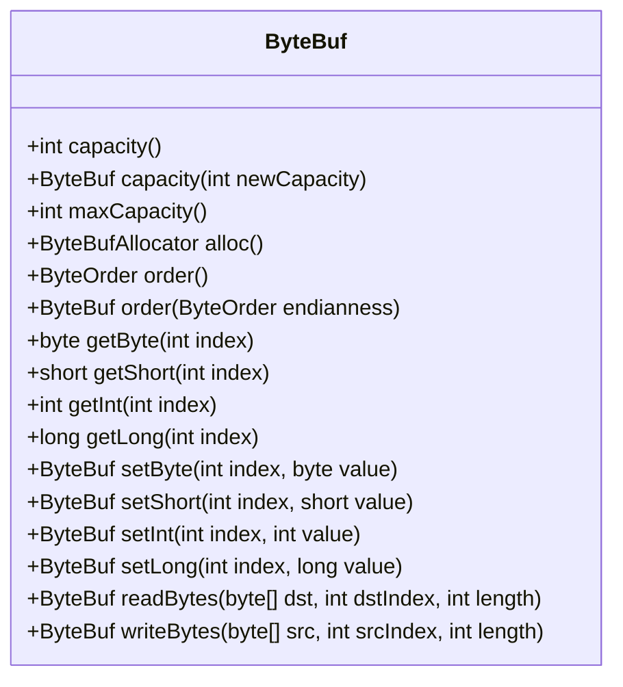

# ByteBuf

ByteBuf는 Netty에서 제공하는 데이터 컨테이너로, JDK의 ByteBuffer에 비해 많은 이점을 제공합니다. 이 장에서는 ByteBuf의 다양한 사용 패턴, 메모리 할당, API 세부 사항, 그리고 ByteBufAllocator의 사용법을 다룹니다.

### 5.1 ByteBuf API

ByteBuf는 클래스 ByteBuf와 인터페이스 ByteBufHolder를 통해 데이터를 처리하는 API를 제공합니다. 주요 이점으로는 사용자 정의 버퍼 타입의 확장성, 투명한 제로-카피, 용량 확장성 등이 있습니다. ByteBuf의 주요 메서드로는 read, write, get, set 등이 있으며, 이들을 통해 데이터를 효율적으로 처리할 수 있습니다.



### 5.2 Class ByteBuf—Netty의 데이터 컨테이너

모든 네트워크 통신은 바이트 시퀀스의 이동을 포함하므로 효율적이고 사용하기 쉬운 데이터 구조가 필요합니다. Netty의 ByteBuf 구현은 이러한 요구 사항을 충족시킵니다. 이제 ByteBuf가 데이터를 접근하기 쉽게 하기 위해 인덱스를 어떻게 사용하는지 살펴보겠습니다.

#### 5.2.1 작동 방식

ByteBuf는 읽기와 쓰기를 위한 두 개의 별도 인덱스를 유지합니다. ByteBuf에서 읽을 때마다 readerIndex가 증가하고, 쓸 때마다 writerIndex가 증가합니다. 예를 들어, readerIndex가 writerIndex에 도달하면 읽을 수 있는 데이터의 끝에 도달한 것입니다. 이를 초과하여 읽으려 하면 IndexOutOfBoundsException이 발생합니다.

**예시 코드**

```java
ByteBuf buffer = ...;
while (buffer.isReadable()) {
    System.out.println(buffer.readByte());
}
```

#### 5.2.2 ByteBuf 사용 패턴

Netty를 사용할 때 여러 가지 일반적인 ByteBuf 사용 패턴이 있습니다.

**힙 버퍼**

힙 공간에 데이터를 저장하는 가장 자주 사용되는 ByteBuf 패턴입니다. 이 패턴은 풀링이 사용되지 않는 상황에서 빠른 할당과 해제를 제공합니다. 예제는 다음과 같습니다:

```java
ByteBuf heapBuf = ...;
if (heapBuf.hasArray()) {                    
    byte[] array = heapBuf.array();                            
    int offset = heapBuf.arrayOffset() + heapBuf.readerIndex();  
    int length = heapBuf.readableBytes();           
    handleArray(array, offset, length);   
}
```

**직접 버퍼**

직접 버퍼는 네이티브 호출을 통해 메모리를 할당하여 네트워크 데이터 전송에 이상적입니다. 직접 버퍼의 주요 단점은 힙 기반 버퍼보다 할당 및 해제 비용이 더 많이 든다는 것입니다.

```java
ByteBuf directBuf = ...;
if (!directBuf.hasArray()) {              
    int length = directBuf.readableBytes();               
    byte[] array = new byte[length];                              
    directBuf.getBytes(directBuf.readerIndex(), array);  
    handleArray(array, 0, length);        
}
```

**컴포지트 버퍼**

컴포지트 버퍼는 여러 ByteBuf의 집합적 뷰를 제공하며, 필요에 따라 ByteBuf 인스턴스를 추가 및 삭제할 수 있습니다.

```java
CompositeByteBuf compBuf = Unpooled.compositeBuffer();
ByteBuf headerBuf = ...;
ByteBuf bodyBuf = ...;
compBuf.addComponents(headerBuf, bodyBuf);
```

> 참고: ByteBuf의 자세한 사용법은 Netty 공식 문서와 예제 코드를 참고하십시오.
