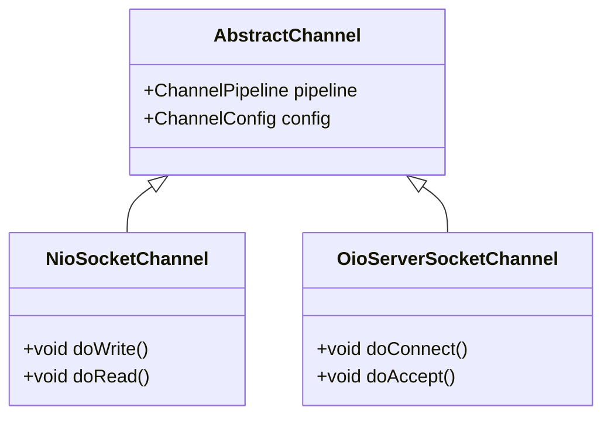

# 트랜스포트

## Chapter 4: Transports

Netty는 다양한 트랜스포트를 제공하여 개발자가 각 애플리케이션 요구 사항에 맞는 최적의 트랜스포트를 선택할 수 있게 합니다. 이 장에서는 Netty의 트랜스포트 구현과 사용 방법, 그리고 적절한 사용 사례에 대해 자세히 설명합니다.

### 4.1 사례 연구: 트랜스포트 마이그레이션

트랜스포트에 대한 이해를 돕기 위해, 간단한 애플리케이션을 통해 OIO와 NIO를 사용한 네트워킹을 살펴봅니다. 이 애플리케이션은 연결을 받아 "Hi!" 메시지를 클라이언트에게 보내고 연결을 종료합니다.

#### 4.1.1 Netty 없이 OIO와 NIO 사용하기

Netty 없이 OIO와 NIO를 사용하는 블로킹 및 비동기 버전을 구현합니다.

**OIO를 사용한 블로킹 네트워킹**

```java
public class PlainOioServer {
    public void serve(int port) throws IOException {
        final ServerSocket socket = new ServerSocket(port);  
        try {
            for (;;) {
                final Socket clientSocket = socket.accept();   
                System.out.println("Accepted connection from " + clientSocket);
                new Thread(new Runnable() {        
                    @Override
                    public void run() {
                        OutputStream out;
                        try {
                            out = clientSocket.getOutputStream();
                            out.write("Hi!\r\n".getBytes(Charset.forName("UTF-8")));
                            out.flush();
                            clientSocket.close();          
                        } catch (IOException e) {
                            e.printStackTrace();
                        } finally {
                            try {
                                clientSocket.close();
                            } catch (IOException ex) {
                                // ignore on close
                            }
                        }
                    }
                }).start();                  
            }
        } catch (IOException e) {
            e.printStackTrace();
        }
    }
}
```

이 코드는 적당한 수의 동시 클라이언트를 처리할 수 있지만, 대규모의 동시 연결을 처리하기 위해 비동기 네트워킹으로 전환해야 할 필요가 있습니다.

**NIO를 사용한 비동기 네트워킹**

```java
public class PlainNioServer {
    public void serve(int port) throws IOException {
        ServerSocketChannel serverChannel = ServerSocketChannel.open();
        serverChannel.configureBlocking(false);
        ServerSocket ssocket = serverChannel.socket();
        InetSocketAddress address = new InetSocketAddress(port);
        ssocket.bind(address);                                       
        Selector selector = Selector.open();                        
        serverChannel.register(selector, SelectionKey.OP_ACCEPT);   
        final ByteBuffer msg = ByteBuffer.wrap("Hi!\r\n".getBytes());
        for (;;) {
            try {
                selector.select();           
            } catch (IOException ex) {
                ex.printStackTrace();
                break;
            }
            Set<SelectionKey> readyKeys = selector.selectedKeys();    
            Iterator<SelectionKey> iterator = readyKeys.iterator();
            while (iterator.hasNext()) {
                SelectionKey key = iterator.next();
                iterator.remove();
                try {
                    if (key.isAcceptable()) {           
                        ServerSocketChannel server = (ServerSocketChannel)key.channel();
                        SocketChannel client = server.accept();
                        client.configureBlocking(false);
                        client.register(selector, SelectionKey.OP_WRITE | SelectionKey.OP_READ, msg.duplicate());     
                        System.out.println("Accepted connection from " + client);
                    }
                    if (key.isWritable()) {                  
                        SocketChannel client = (SocketChannel)key.channel();
                        ByteBuffer buffer = (ByteBuffer)key.attachment();
                        while (buffer.hasRemaining()) {
                            if (client.write(buffer) == 0) {    
                                break;
                            }
                        }
                        client.close();             
                    }
                } catch (IOException ex) {
                    key.cancel();
                    try {
                        key.channel().close();
                    } catch (IOException cex) {
                        // ignore on close
                    }
                }
            }
        }
    }
}
```

이 코드는 비동기 I/O를 사용하여 많은 수의 동시 연결을 처리할 수 있지만, 코드 복잡성이 증가합니다.

#### 4.1.2 Netty를 사용한 OIO와 NIO

Netty를 사용하면 트랜스포트 변경이 훨씬 간단해집니다. Netty의 통일된 API 덕분에 코드 베이스를 거의 수정하지 않고도 트랜스포트를 전환할 수 있습니다.

**Netty를 사용한 블로킹 네트워킹**

```java
public class NettyOioServer {
    public void server(int port) throws Exception {
        final ByteBuf buf = Unpooled.unreleasableBuffer(Unpooled.copiedBuffer("Hi!\r\n", Charset.forName("UTF-8")));
        EventLoopGroup group = new OioEventLoopGroup();
        try {
            ServerBootstrap b = new ServerBootstrap();    
            b.group(group)
                .channel(OioServerSocketChannel.class)         
                .localAddress(new InetSocketAddress(port))
                .childHandler(new ChannelInitializer<SocketChannel>() { 
                    @Override
                    public void initChannel(SocketChannel ch) throws Exception {
                        ch.pipeline().addLast(new ChannelInboundHandlerAdapter() { 
                            @Override
                            public void channelActive(ChannelHandlerContext ctx) throws Exception {
                                ctx.writeAndFlush(buf.duplicate()).addListener(ChannelFutureListener.CLOSE);  
                            }
                        });
                    }
                });
            ChannelFuture f = b.bind().sync();       
            f.channel().closeFuture().sync();
        } finally {
            group.shutdownGracefully().sync();          
        }
    }
}
```

**Netty를 사용한 비동기 네트워킹**

```java
public class NettyNioServer {
    public void server(int port) throws Exception {
        final ByteBuf buf = Unpooled.copiedBuffer("Hi!\r\n", Charset.forName("UTF-8"));
        EventLoopGroup group = new NioEventLoopGroup();   
        try {
            ServerBootstrap b = new ServerBootstrap();      
            b.group(group)
             .channel(NioServerSocketChannel.class)
             .localAddress(new InetSocketAddress(port))
             .childHandler(new ChannelInitializer<SocketChannel>() { 
                @Override
                public void initChannel(SocketChannel ch) throws Exception{
                    ch.pipeline().addLast(new ChannelInboundHandlerAdapter() {   
                        @Override
                        public void channelActive(ChannelHandlerContext ctx) throws Exception {
                            ctx.writeAndFlush(buf.duplicate()).addListener(ChannelFutureListener.CLOSE);
                        }
                    });
                }
            });
            ChannelFuture f = b.bind().sync();      
            f.channel().closeFuture().sync();
        } finally {
            group.shutdownGracefully().sync();         
        }
    }
}
```

Netty는 동일한 API를 노출하므로, 트랜스포트 구현에 상관없이 코드가 거의 변경되지 않습니다.

### 4.2 트랜스포트 API

트랜스포트 API의 핵심은 `Channel` 인터페이스입니다. 이는 모든 I/O 작업에 사용되며, `Channel` 클래스 계층 구조는 다음과 같습니다.



`Channel`에는 `ChannelPipeline`과 `ChannelConfig`가 할당되어 있습니다. `ChannelConfig`는 채널의 모든 설정을 보유하며 핫 변경을 지원합니다. 특정 트랜스포트는 고유한 설정을 가질 수 있으므로 `ChannelConfig`의 하위 타입을 구현할 수 있습니다.

`Channel`은 유일하기 때문에 `java.lang.Comparable`의 하위 인터페이스로 선언되어 순서를 보장합니다. 따라서 `AbstractChannel`의 `compareTo()` 구현은 두 개의 고유한 `Channel` 인스턴스가 동일한 해시 코드를 반환하면 오류를 발생시킵니다.

#### ChannelPipeline과 ChannelHandler

`ChannelPipeline`은 모든 `ChannelHandler` 인스턴스를 보유하여 인바운드 및 아웃바운드 데이터와 이벤트에 적용됩니다. 이 `ChannelHandler`들은 상태 변화를 처리하고 데이터를 처리하는 애플리케이션의 로직을 구현합니다.

일반적인 `ChannelHandler`의 사용 예:

* 데이터를 한 형식에서 다른 형식으로 변환
* 예외 알림 제공
* `Channel`이 활성화 또는 비활성화될 때 알림 제공
* `Channel`이 `EventLoop`에 등록되거나 등록 해제될 때 알림 제공
* 사용자 정의 이벤트에 대한 알림 제공

#### 주요 Channel 메서드

| 메서드 이름        | 설명                                                  |
| ------------- | --------------------------------------------------- |
| eventLoop     | 채널에 할당된 `EventLoop`을 반환합니다.                         |
| pipeline      | 채널에 할당된 `ChannelPipeline`을 반환합니다.                   |
| isActive      | 채널이 활성 상태인지 여부를 반환합니다.                              |
| localAddress  | 로컬 `SocketAddress`를 반환합니다.                          |
| remoteAddress | 원격 `SocketAddress`를 반환합니다.                          |
| write         | 원격 피어에 데이터를 씁니다. 이 데이터는 `ChannelPipeline`을 통해 전달됩니다 |
| flush         | 이전에 기록된 데이터를 기저 트랜스포트에 플러시합니다.                      |

### 4.3 포함된 트랜스포트

Netty는 다양한 트랜스포트를 제공하여 개발자가 각 애플리케이션의 요구 사항에 맞는 최적의 솔루션을 선택할 수 있게 합니다. 여기서는 Netty가 제공하는 주요 트랜스포트들을 소개합니다.

#### 4.3.1 NIO—논블로킹 I/O

NIO는 Netty의 주요 논블로킹 트랜스포트입니다. `java.nio.channels` 패키지를 사용하며, 선택기(Selector) 기반으로 단일 스레드가 여러 연결을 효율적으로 처리할 수 있습니다.

**NIO의 특징**

* **비동기 I/O 작업 지원**: 모든 I/O 작업이 비동기적으로 수행됩니다.
* **높은 확장성**: 많은 수의 동시 연결을 처리할 수 있습니다.
* **제로 카피 파일 전송 지원**: FTP 또는 HTTP와 같은 특정 사용 사례에서 성능을 향상시킵니다.

**코드 예제**

```java
public class NioServer {
    public static void main(String[] args) {
        EventLoopGroup bossGroup = new NioEventLoopGroup(1);
        EventLoopGroup workerGroup = new NioEventLoopGroup();
        try {
            ServerBootstrap b = new ServerBootstrap();
            b.group(bossGroup, workerGroup)
             .channel(NioServerSocketChannel.class)
             .childHandler(new ChannelInitializer<SocketChannel>() {
                 @Override
                 public void initChannel(SocketChannel ch) throws Exception {
                     ch.pipeline().addLast(new EchoServerHandler());
                 }
             });

            ChannelFuture f = b.bind(8080).sync();
            f.channel().closeFuture().sync();
        } finally {
            bossGroup.shutdownGracefully();
            workerGroup.shutdownGracefully();
        }
    }
}
```

#### 4.3.2 Epoll 네이티브 논블로킹 트랜스포트

Epoll은 리눅스에서 높은 성능을 제공하는 네이티브 논블로킹 트랜스포트입니다. 리눅스의 `epoll` 메커니즘을 사용하여 높은 성능과 확장성을 제공합니다.

**Epoll의 특징**

* **리눅스 전용**: 리눅스 운영 체제에서만 사용 가능합니다.
* **높은 성능**: 리눅스의 네이티브 `epoll` 메커니즘을 사용하여 성능을 극대화합니다.
* **낮은 지연 시간**: 대규모 동시 연결에서 낮은 지연 시간을 유지합니다.

#### 4.3.3 OIO—블로킹 I/O

OIO는 전통적인 블로킹 I/O 모델을 사용하는 트랜스포트입니다. 간단한 사용 사례나 레거시 코드의 이주에 유용합니다.

**OIO의 특징**

* **블로킹 I/O 작업 지원**: 간단한 애플리케이션에 적합합니다.
* **적은 스레드 사용**: 각 연결이 별도의 스레드에서 처리되므로 멀티스레드 환경에 익숙하지 않은 개발자에게 유용합니다.

**코드 예제**

```java
public class OioServer {
    public static void main(String[] args) {
        EventLoopGroup bossGroup = new OioEventLoopGroup();
        try {
            ServerBootstrap b = new ServerBootstrap();
            b.group(bossGroup)
             .channel(OioServerSocketChannel.class)
             .childHandler(new ChannelInitializer<SocketChannel>() {
                 @Override
                 public void initChannel(SocketChannel ch) throws Exception {
                     ch.pipeline().addLast(new EchoServerHandler());
                 }
             });

            ChannelFuture f = b.bind(8080).sync();
            f.channel().closeFuture().sync();
        } finally {
            bossGroup.shutdownGracefully();
        }
    }
}
```

#### 4.3.4 로컬 트랜스포트

Netty는 같은 JVM 내에서 비동기 통신을 위해 로컬 트랜스포트를 제공합니다. 이 트랜스포트는 실제 네트워크 주소에 바인딩되지 않고 레지스트리에 저장됩니다. 이 트랜스포트를 사용하여 서버와 클라이언트 간의 통신을 효율적으로 처리할 수 있습니다.

**로컬 트랜스포트의 특징**

* **같은 JVM 내에서의 통신 지원**: 실제 네트워크 트래픽을 처리하지 않으며, 네트워크 오버헤드를 제거할 수 있습니다.
* **빠른 데이터 전송**: 높은 성능을 요구하는 내부 통신에 적합합니다.

#### 4.3.5 임베디드 트랜스포트

Netty는 테스트 목적을 위해 임베디드 트랜스포트를 제공합니다. 이를 통해 실제 네트워크 객체를 생성하지 않고도 ChannelHandler를 단위 테스트할 수 있습니다.

**임베디드 트랜스포트의 특징**

* **단위 테스트 용도**: 모의 객체를 생성할 필요 없이 실제 트랜스포트와 동일한 API 이벤트 흐름을 보장합니다.
* **테스트 환경 최적화**: 테스트 환경에서 네트워크 의존성을 제거할 수 있습니다.

### 4.4 트랜스포트 사용 사례

각 트랜스포트의 사용 사례는 다음과 같습니다:

* **NIO**: 높은 동시성과 성능이 중요한 웹 서버 및 대규모 시스템에 적합합니다.
* **OIO**: 단순한 애플리케이션이나 레거시 코드의 이주 시 유용합니다.
* **로컬 트랜스포트**: 단위 테스트 및 로컬 통신 시 사용됩니다.
* **임베디드 트랜스포트**: 테스트 환경에서 네트워크 의존성을 제거하여 효율적인 테스트를 가능하게 합니다.

> 참고: Netty의 트랜스포트 API는 다양한 트랜스포트를 통일된 방식으로 다룰 수 있게 하여, 개발자가 각 애플리케이션의 요구에 맞는 트랜스포트를 쉽게 선택하고 전환할 수 있게 합니다.
