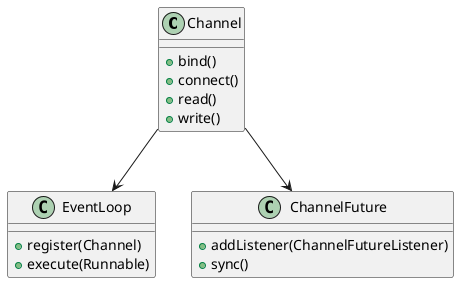
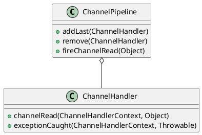
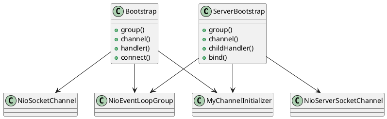

# 구성 요소 및 설계

알겠습니다. 더 자세하게 작성하고, 그림도 더 풍부하게 추가하겠습니다.

***

### Netty: 구성 요소 및 설계

이번 포스트에서는 Netty의 주요 구성 요소와 설계 원리에 대해 자세히 알아보겠습니다. 이를 통해 Netty 애플리케이션을 효과적으로 구성하고 설계하는 방법을 배우겠습니다.

#### 3.1 채널, 이벤트 루프 및 채널 퓨처

Netty의 주요 구성 요소는 `Channel`, `EventLoop`, 그리고 `ChannelFuture`입니다. 이들 각각이 무엇인지, 그리고 어떻게 동작하는지 살펴보겠습니다.

**3.1.1 채널(Channel)**

채널은 네트워크 연결을 추상화한 객체입니다. Netty에서는 다양한 유형의 채널을 제공합니다. 예를 들어, `NioSocketChannel`은 비차단형 I/O 소켓 채널입니다. 채널은 데이터를 송수신하기 위한 주요 인터페이스입니다.

```kotlin
import io.netty.channel.Channel

// 채널 인터페이스
interface MyChannel : Channel {
    // 데이터 송수신 메서드 정의
}
```

**3.1.2 이벤트 루프(EventLoop)**

이벤트 루프는 채널의 모든 이벤트를 처리하는 단일 스레드입니다. Netty는 채널당 하나의 이벤트 루프를 할당하여, 해당 채널에 대한 모든 I/O 작업을 처리합니다. 이벤트 루프는 비동기 작업을 처리하고, 이벤트를 핸들러에 전달합니다.

```kotlin
import io.netty.channel.EventLoop

// 이벤트 루프 인터페이스
interface MyEventLoop : EventLoop {
    // 이벤트 처리 메서드 정의
}
```

**3.1.3 채널 퓨처(ChannelFuture)**

채널 퓨처는 비동기 작업의 결과를 나타내는 객체입니다. 이는 작업이 완료되었을 때 알림을 받고, 결과를 확인할 수 있는 방법을 제공합니다. Netty의 `ChannelFuture` 인터페이스는 비동기 작업의 상태를 나타내며, 작업이 완료되면 리스너를 통해 알림을 받습니다.

```kotlin
import io.netty.channel.ChannelFuture

// 채널 퓨처 인터페이스
interface MyChannelFuture : ChannelFuture {
    // 비동기 작업 상태 확인 메서드 정의
}
```

**3.1.4 구성 요소 다이어그램**



#### 3.2 채널 핸들러 및 채널 파이프라인

Netty의 주요 개념 중 하나는 `ChannelHandler`와 `ChannelPipeline`입니다. 이들은 네트워크 이벤트를 처리하고 데이터를 변환하는 데 사용됩니다.

**3.2.1 채널 핸들러(ChannelHandler)**

채널 핸들러는 네트워크 이벤트를 처리하는 로직을 구현합니다. 예를 들어, 수신된 데이터를 처리하거나, 송신할 데이터를 준비합니다. `ChannelInboundHandler`는 수신된 데이터를 처리하고, `ChannelOutboundHandler`는 송신할 데이터를 처리합니다.

```kotlin
import io.netty.channel.ChannelHandlerContext
import io.netty.channel.ChannelInboundHandlerAdapter

class MyChannelHandler : ChannelInboundHandlerAdapter() {
    override fun channelRead(ctx: ChannelHandlerContext, msg: Any) {
        // 수신된 메시지 처리
        println("Received message: $msg")
        ctx.writeAndFlush(msg)
    }

    override fun exceptionCaught(ctx: ChannelHandlerContext, cause: Throwable) {
        cause.printStackTrace()
        ctx.close()
    }
}
```

**3.2.2 채널 파이프라인(ChannelPipeline)**

채널 파이프라인은 여러 개의 채널 핸들러를 체인으로 연결한 것입니다. 데이터가 채널을 통해 전송될 때, 각 핸들러는 순차적으로 데이터를 처리합니다. 파이프라인은 데이터를 변환하거나, 로깅하거나, 인증을 수행하는 데 사용됩니다.

```kotlin
import io.netty.channel.ChannelInitializer
import io.netty.channel.socket.SocketChannel

class MyChannelInitializer : ChannelInitializer<SocketChannel>() {
    override fun initChannel(ch: SocketChannel) {
        ch.pipeline().addLast(MyChannelHandler())
    }
}
```

**3.2.3 구성 요소 다이어그램**



#### 3.3 부트스트래핑(Bootstrapping)

부트스트래핑은 Netty 애플리케이션을 설정하고 시작하는 과정입니다. 서버와 클라이언트 모두 부트스트랩 클래스가 있으며, 이들은 네트워크 설정을 관리합니다.

**3.3.1 서버 부트스트랩(ServerBootstrap)**

서버 부트스트랩은 서버 애플리케이션을 설정하고 시작합니다. 이를 통해 서버 소켓을 바인딩하고, 클라이언트 연결을 기다립니다.

```kotlin
import io.netty.bootstrap.ServerBootstrap
import io.netty.channel.nio.NioEventLoopGroup
import io.netty.channel.socket.nio.NioServerSocketChannel

fun startServer(port: Int) {
    val bossGroup = NioEventLoopGroup()
    val workerGroup = NioEventLoopGroup()
    try {
        val b = ServerBootstrap()
        b.group(bossGroup, workerGroup)
            .channel(NioServerSocketChannel::class.java)
            .childHandler(MyChannelInitializer())
            .option(ChannelOption.SO_BACKLOG, 128)
            .childOption(ChannelOption.SO_KEEPALIVE, true)

        val f = b.bind(port).sync()
        f.channel().closeFuture().sync()
    } finally {
        workerGroup.shutdownGracefully()
        bossGroup.shutdownGracefully()
    }
}
```

**3.3.2 클라이언트 부트스트랩(Bootstrap)**

클라이언트 부트스트랩은 클라이언트 애플리케이션을 설정하고 시작합니다. 이를 통해 서버에 연결하고, 데이터를 송수신합니다.

```kotlin
import io.netty.bootstrap.Bootstrap
import io.netty.channel.nio.NioEventLoopGroup
import io.netty.channel.socket.nio.NioSocketChannel

fun startClient(host: String, port: Int) {
    val group = NioEventLoopGroup()
    try {
        val b = Bootstrap()
        b.group(group)
            .channel(NioSocketChannel::class.java)
            .handler(MyChannelInitializer())

        val f = b.connect(host, port).sync()
        f.channel().closeFuture().sync()
    } finally {
        group.shutdownGracefully()
    }
}
```

**3.3.3 부트스트래핑 다이어그램**


