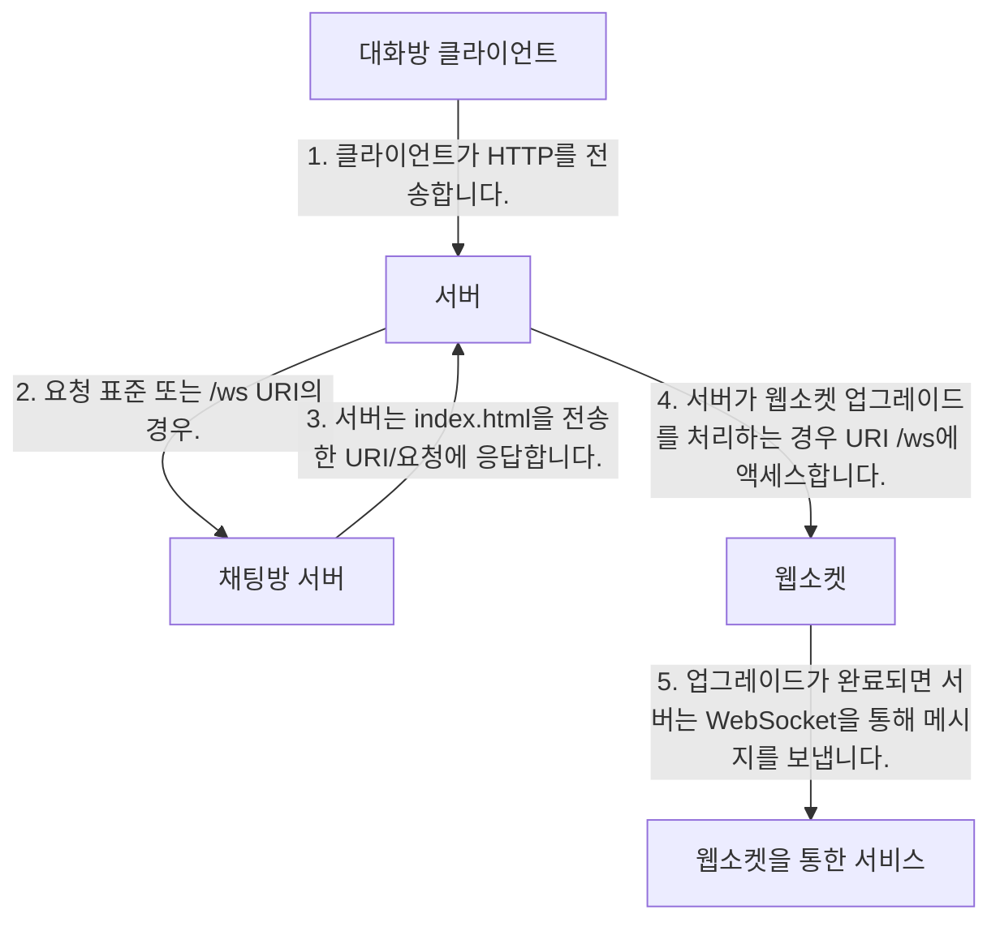

# Web Socket

## Netty를 이용한 WebSocket

### 이 장에서 다루는 내용

* 실시간 웹의 개념
* WebSocket 프로토콜
* Netty를 사용한 WebSocket 기반 채팅 서버 구축

### WebSocket 소개

WebSocket 프로토콜은 클라이언트와 서버가 언제든지 메시지를 전송할 수 있도록 양방향 데이터 전송 문제를 해결하기 위해 설계되었습니다. 최신 브라우저 대부분은 WebSocket을 HTML5의 클라이언트 API로 지원합니다.

Netty는 WebSocket을 완벽히 지원하며, 이를 사용하여 실시간 채팅 애플리케이션을 구현할 수 있습니다.

### 예제 WebSocket 애플리케이션

이번 예제 애플리케이션은 WebSocket 프로토콜을 사용하여 브라우저 기반 채팅 애플리케이션을 구현합니다. 다수의 사용자가 동시에 통신할 수 있도록 할 것입니다.



### WebSocket 지원 추가

WebSocket으로 전환하기 위해 업그레이드 핸드셰이크 메커니즘이 사용됩니다. /ws로 끝나는 URL이 요청되면 WebSocket으로 프로토콜을 업그레이드합니다.

#### HTTP 요청 처리

먼저 HTTP 요청을 처리하는 구성 요소를 구현합니다. 이 구성 요소는 채팅방에 접근할 수 있는 페이지를 제공하고, 연결된 클라이언트가 보낸 메시지를 표시합니다.

```java
public class HttpRequestHandler extends SimpleChannelInboundHandler<FullHttpRequest> {
    private final String wsUri;
    private static final File INDEX;
    static {
        URL location = HttpRequestHandler.class.getProtectionDomain().getCodeSource().getLocation();
        try {
            String path = location.toURI() + "index.html";
            path = !path.contains("file:") ? path : path.substring(5);
            INDEX = new File(path);
        } catch (URISyntaxException e) {
            throw new IllegalStateException("Unable to locate index.html", e);
        }
    }

    public HttpRequestHandler(String wsUri) {
        this.wsUri = wsUri;
    }

    @Override
    public void channelRead0(ChannelHandlerContext ctx, FullHttpRequest request) throws Exception {
        if (wsUri.equalsIgnoreCase(request.getUri())) {
            ctx.fireChannelRead(request.retain());
        } else {
            if (HttpHeaders.is100ContinueExpected(request)) {
                send100Continue(ctx);
            }
            RandomAccessFile file = new RandomAccessFile(INDEX, "r");
            HttpResponse response = new DefaultHttpResponse(request.getProtocolVersion(), HttpResponseStatus.OK);
            response.headers().set(HttpHeaders.Names.CONTENT_TYPE, "text/plain; charset=UTF-8");
            boolean keepAlive = HttpHeaders.isKeepAlive(request);
            if (keepAlive) {
                response.headers().set(HttpHeaders.Names.CONTENT_LENGTH, file.length());
                response.headers().set(HttpHeaders.Names.CONNECTION, HttpHeaders.Values.KEEP_ALIVE);
            }
            ctx.write(response);
            if (ctx.pipeline().get(SslHandler.class) == null) {
                ctx.write(new DefaultFileRegion(file.getChannel(), 0, file.length()));
            } else {
                ctx.write(new ChunkedNioFile(file.getChannel()));
            }
            ChannelFuture future = ctx.writeAndFlush(LastHttpContent.EMPTY_LAST_CONTENT);
            if (!keepAlive) {
                future.addListener(ChannelFutureListener.CLOSE);
            }
        }
    }

    private static void send100Continue(ChannelHandlerContext ctx) {
        FullHttpResponse response = new DefaultFullHttpResponse(HttpVersion.HTTP_1_1, HttpResponseStatus.CONTINUE);
        ctx.writeAndFlush(response);
    }

    @Override
    public void exceptionCaught(ChannelHandlerContext ctx, Throwable cause) throws Exception {
        cause.printStackTrace();
        ctx.close();
    }
}
```

#### WebSocket 프레임 처리

WebSocket은 데이터를 프레임 단위로 전송합니다. Netty는 RFC에 정의된 여섯 가지 프레임 유형을 지원합니다. 여기에는 텍스트 데이터가 포함된 `TextWebSocketFrame`도 포함됩니다.

```java
public class TextWebSocketFrameHandler extends SimpleChannelInboundHandler<TextWebSocketFrame> {
    private final ChannelGroup group;

    public TextWebSocketFrameHandler(ChannelGroup group) {
        this.group = group;
    }

    @Override
    public void userEventTriggered(ChannelHandlerContext ctx, Object evt) throws Exception {
        if (evt == WebSocketServerProtocolHandler.ServerHandshakeStateEvent.HANDSHAKE_COMPLETE) {
            ctx.pipeline().remove(HttpRequestHandler.class);
            group.writeAndFlush(new TextWebSocketFrame("Client " + ctx.channel() + " joined"));
            group.add(ctx.channel());
        } else {
            super.userEventTriggered(ctx, evt);
        }
    }

    @Override
    public void channelRead0(ChannelHandlerContext ctx, TextWebSocketFrame msg) throws Exception {
        group.writeAndFlush(msg.retain());
    }
}
```

#### ChannelPipeline 초기화

채널이 생성될 때마다 `ChannelPipeline`을 초기화하기 위해 `ChannelInitializer`를 확장합니다.

```java
public class ChatServerInitializer extends ChannelInitializer<Channel> {
    private final ChannelGroup group;

    public ChatServerInitializer(ChannelGroup group) {
        this.group = group;
    }

    @Override
    protected void initChannel(Channel ch) throws Exception {
        ChannelPipeline pipeline = ch.pipeline();
        pipeline.addLast(new HttpServerCodec());
        pipeline.addLast(new ChunkedWriteHandler());
        pipeline.addLast(new HttpObjectAggregator(64 * 1024));
        pipeline.addLast(new HttpRequestHandler("/ws"));
        pipeline.addLast(new WebSocketServerProtocolHandler("/ws"));
        pipeline.addLast(new TextWebSocketFrameHandler(group));
    }
}
```

#### 서버 부트스트래핑

서버를 부트스트래핑하고 `ChatServerInitializer`를 설치합니다.

```java
public class ChatServer {
    private final ChannelGroup channelGroup = new DefaultChannelGroup(ImmediateEventExecutor.INSTANCE);
    private final EventLoopGroup group = new NioEventLoopGroup();
    private Channel channel;

    public ChannelFuture start(InetSocketAddress address) {
        ServerBootstrap bootstrap = new ServerBootstrap();
        bootstrap.group(group).channel(NioServerSocketChannel.class).childHandler(createInitializer(channelGroup));
        ChannelFuture future = bootstrap.bind(address);
        future.syncUninterruptibly();
        channel = future.channel();
        return future;
    }

    protected ChannelInitializer<Channel> createInitializer(ChannelGroup group) {
        return new ChatServerInitializer(group);
    }

    public void destroy() {
        if (channel != null) {
            channel.close();
        }
        channelGroup.close();
        group.shutdownGracefully();
    }

    public static void main(String[] args) throws Exception {
        if (args.length != 1) {
            System.err.println("Please give port as argument");
            System.exit(1);
        }
        int port = Integer.parseInt(args[0]);
        final ChatServer endpoint = new ChatServer();
        ChannelFuture future = endpoint.start(new InetSocketAddress(port));
        Runtime.getRuntime().addShutdownHook(new Thread() {
            @Override
            public void run() {
                endpoint.destroy();
            }
        });
        future.channel().closeFuture().syncUninterruptibly();
    }
}
```

#### 애플리케이션 테스트

서버를 빌드하고 시작하기 위해 다음 Maven 명령을 사용합니다.

```sh
mvn -PChatServer clean package exec:exec
```

다음과 같은 URL을 통해 애플리케이션에 접근할 수 있습니다: [http://localhost:9999](http://localhost:9999).


### 암호화 추가

실제 시나리오에서는 서버에 암호화를 추가해야 할 수 있습니다. Netty를 사용하면 `ChannelPipeline`에 `SslHandler`를 추가하고 구성하기만 하면 됩니다.

```java
public class SecureChatServerInitializer extends ChatServerInitializer {
    private final SslContext context;

    public SecureChatServerInitializer(ChannelGroup group, SslContext context) {
        super(group);
        this.context = context;
    }

    @Override
    protected void initChannel(Channel ch) throws Exception {
        super.initChannel(ch);
        SSLEngine engine = context.newEngine(ch.alloc());
        ch.pipeline().addFirst(new SslHandler(engine));
    }
}
```

다음으로, `ChatServer`를 `SecureChatServerInitializer`를 사용하도록 수정하여 `SslHandler`를 설치합니다.

```java
public class SecureChatServer extends ChatServer {
    private final SslContext context;

    public SecureChatServer(SslContext context) {
        this.context = context;
    }

    @Override
    protected ChannelInitializer<Channel> createInitializer(ChannelGroup group) {
        return new Secure

ChatServerInitializer(group, context);
    }

    public static void main(String[] args) throws Exception {
        if (args.length != 1) {
            System.err.println("Please give port as argument");
            System.exit(1);
        }
        int port = Integer.parseInt(args[0]);
        SelfSignedCertificate cert = new SelfSignedCertificate();
        SslContext context = SslContext.newServerContext(cert.certificate(), cert.privateKey());
        final SecureChatServer endpoint = new SecureChatServer(context);
        ChannelFuture future = endpoint.start(new InetSocketAddress(port));
        Runtime.getRuntime().addShutdownHook(new Thread() {
            @Override
            public void run() {
                endpoint.destroy();
            }
        });
        future.channel().closeFuture().syncUninterruptibly();
    }
}
```
