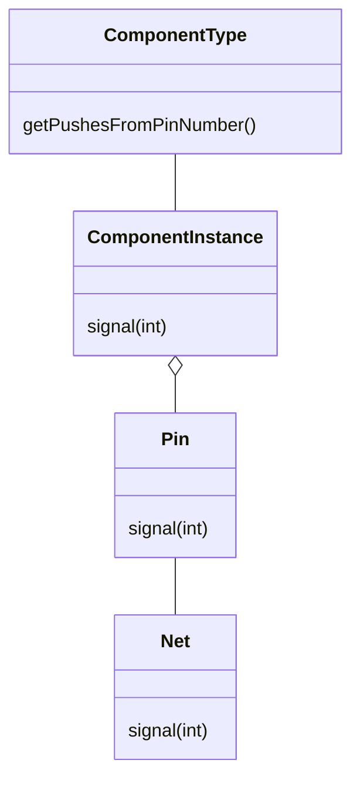

# 지식 탐구

1장은 PCB 설계에서 낯선 도메인을 마주친 예시로 시작된다\
가장 처음 발견한 도메인 요소는 NET라는것과 그에 대한 세부사항이였다.


이런 단순한 다이어그램 으로 시작하여 대화를 통해 점점 구체화 되는 `상호작용 다이어그램3ㅈ3ㅈ3ㅈ`을 완성하여 가장 초기 모델의 클래스 다이어 그램을 추출한다.



도메인 모델 추출로 프로토 타입을 생성하여 프로젝트를 진행한 예시이다

***

## 효과적인 모델링 요소

풍부한 도메인 모델을 추출&정제하는 일련의 순서이다

```
1. 모델과 구현의 연계 
2. 모델 기반으로 언어 정제
3. 풍부한 지식이 담긴 모델 개발
4. 모델의 정제
5. 브레인 스토밍과 실험
```

### 지식 탐구

도메인 모델링을 효율적으로 수행하는 사람도 지식을 섬세하게 탐구한다.\
많은 정보속에서 관련성을 찾아내어, 여러 시행착오를 거친다.

개발자와 도메인 전문가로 구성된 팀은 대부분 개발자가 이끄는 가운데 협업하는 경향을 가진다.

<details>

<summary>폭포수 모델</summary>

폭포수 개발방법에서는 피드백없이 개발만 진행된다. 원하는 기능을 기술하게 한다음 기능을 구현한다. \
원리는 알지 못한채, 수정사항만 습득하여 급급내 기능만 구현하게되는 불상사가 생긴다

</details>

재료가 되는 지식은 개발자의 경험& 도메인 전문가의 지식에서 나온다,\
이러한 지식은 문서의 형태를 띄며, 대화, 회의 여러가지 소통을 통해 진행된다.

### 지속적인 학습

소프트웨어를 작성하는 초기에는 충분히 알지 못한 상태에서 시작하게 된다.\
프로젝트에서 다루는 지식은 단면적이며, 흩어져있고, 필요한 정보를 추출하기 까다롭다.

첫 예시와 같이 어플리케이션과 관련된 주요 개념을 이해하며, 만드는 어플리케이션이 정상적으로 ( 원하는 방향으로) 동작하는지 점검하는것이 중요하다.

### 풍부한 지식이 담긴 설계

도메인 모델을 추출하는 가장 빠르고 단순한 방법은 `명사찾기`이다 도메인과 관련된 엔티티 및 액션과 규칙도 굉장히 중요한데, 이런 개념은 아주 다양한 종류가 있다.

도메인 지식을 활용하여, 업무규칙간 모순되는 부분을 조정하며, 규칙의 빈틈이 생기지 않도록 구체화하고 명확하게 하여야한다.

***

#### 심층 모델

유용한 모델은 겉으로 드러나있는 경우가 없다.

도메인과 어플리케이션의 요구사항을 이해하게 되면서, 처음에 생각했던 요소를 버리거나 관점을 바꾸게된다.
